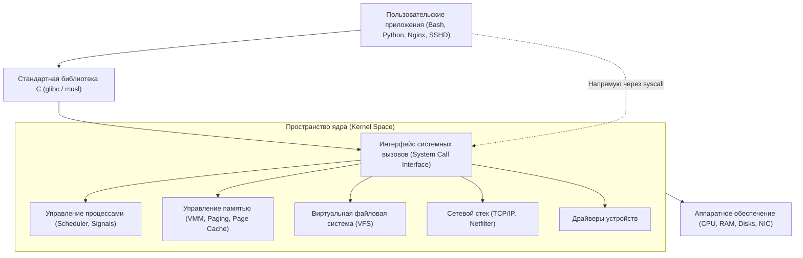

# Модуль 01: Архитектура Linux, Shell-окружение и работа с потоками

## 1. Архитектура операционной системы Linux

Linux — это многопользовательская многозадачная операционная система, построенная на монолитном ядре с модульной архитектурой.



### Кольца защиты (Protection Rings) в x86_64:
- **Ring 0 (Kernel Space)**: Полный доступ к памяти и инструкциям процессора. Ядро управляет прерываниями, аппаратными устройствами и переключением контекста.
- **Ring 3 (User Space)**: Изолированное окружение процессов. Прямой доступ к устройствам запрещен. Любое взаимодействие с железом (диск, сеть, консоль) требует перехода в Ring 0 через **системный вызов (syscall)** (например: `read()`, `write()`, `open()`, `fork()`, `execve()`).

---

## 2. Стандарт иерархии файловой системы (FHS — Filesystem Hierarchy Standard)

В Linux всё организовано в единое дерево каталогов, начинающееся с корневого каталога `/`.

| Каталог | Назначение | Особенности для администратора |
| :--- | :--- | :--- |
| `/bin` -> `usr/bin` | Основные исполняемые файлы для всех пользователей | `ls`, `cp`, `cat`, `bash` (в современных дистрибутивах symlink на `/usr/bin`) |
| `/sbin` -> `usr/sbin`| Системные бинарные файлы для суперпользователя | `iptables`, `fdisk`, `reboot`, `ip` |
| `/etc` | Конфигурационные файлы системы и сервисов | Статический текст. Здесь лежат `passwd`, `fstab`, конфигурации Nginx, SSH |
| `/dev` | Файлы устройств (Device nodes) | Создаются динамически подсистемой `udev` (`/dev/sda`, `/dev/null`, `/dev/urandom`) |
| `/proc` | Виртуальная псевдо-ФС ядра (состояние процессов и ядра) | Не занимает места на диске! (`/proc/cpuinfo`, `/proc/meminfo`, `/proc/<PID>/`) |
| `/sys` | Виртуальная ФС ядра (аппаратное окружение и драйверы) | Экспорт информации ядра об устройствах и шинах (sysfs) |
| `/var` | Переменные данные (логи, кэши, базы данных, очереди) | `/var/log` (системные журналы), `/var/spool`, `/var/lib` |
| `/tmp` | Временные файлы | Часто монтируется в RAM (`tmpfs`), очищается при перезагрузке |
| `/home` | Домашние каталоги обычных пользователей | Хранит пользовательские данные и профили (`~/.bashrc`, `~/.ssh`) |
| `/root` | Домашний каталог суперпользователя `root` | Отделен от `/home`, чтобы быть доступным даже если `/home` на отдельном диске не смонтирован |
| `/opt` | Стороннее программное обеспечение (Add-on packages) | Вендорные пакеты (Google Chrome, GitLab, custom agents) |
| `/mnt` & `/media` | Точки монтирования внешних носителей | `/mnt` — ручное временное монтирование; `/media` — авто-монтирование флешек и CD |

---

## 3. Файловые дескрипторы и стандартные потоки (I/O Streams)

Каждый запускаемый процесс в Linux автоматически получает три открытых файловых дескриптора (File Descriptors):

| Дескриптор (FD) | Название | Назначение | Источник / Назначение по умолчанию |
| :--- | :--- | :--- | :--- |
| **0** | `stdin` | Стандартный ввод | Клавиатура (терминал) |
| **1** | `stdout` | Стандартный вывод | Монитор (терминал) |
| **2** | `stderr` | Стандартный вывод ошибок | Монитор (терминал) |

### Операторы перенаправления (Redirection):

1. **Перенаправление вывода:**
   - `command > file.txt` — перезаписать `stdout` в файл (дескриптор 1 опущен).
   - `command >> file.txt` — дописать (append) `stdout` в конец файла.
   - `command 2> error.log` — записать только ошибки (`stderr`) в файл.
   - `command > output.log 2>&1` или `command &> output.log` — объединить `stdout` и `stderr` в один файл.
   - `command 2> /dev/null` — подавить вывод ошибок (отправить в "черную дыру").

2. **Перенаправление ввода:**
   - `command < input.txt` — читать ввод из файла вместо клавиатуры.
   - **Here-Document (`<<EOF`)**: передача многострочного блока текста скрипту:
     ```bash
     cat << 'EOF' > /etc/sample.conf
     listen = 0.0.0.0:8080
     workers = 4
     EOF
     ```

3. **Конвейеры (Pipes `|`):**
   - Перенаправляют дескриптор `stdout` (FD 1) левой команды в дескриптор `stdin` (FD 0) правой команды в памяти (через буфер ядра, без промежуточной записи на диск).
   - `command1 2>&1 | command2` — передать как обычный вывод, так и ошибки в конвейер.
   - `tee`: разветвитель потока — пишет одновременно в файл и в `stdout`.
     ```bash
     echo "server_name example.com;" | sudo tee -a /etc/nginx/conf.d/test.conf
     ```

---

## 4. Главные инструменты системного администратора для обработки текста

### 1. `grep` / `egrep` — Поиск по регулярным выражениям
- `-i`: игнорировать регистр (`grep -i "error" /var/log/syslog`)
- `-v`: инвертировать поиск (показать строки, НЕ содержащие шаблон)
- `-E`: использовать расширенные регулярные выражения (ERE)
- `-r` / `-R`: рекурсивный поиск по каталогам
- `-n`: выводить номера строк
- `-c`: подсчет количества совпадений
- `-o`: выводить только совпавшую часть строки, а не всю строку целиком

### 2. `awk` — Мощный язык построчной обработки структурированных данных
`awk 'шаблон { действие }' файл`
- По умолчанию разделяет строки пробелами или символами табуляции.
- Переменные:
  - `$0`: вся строка
  - `$1, $2, ... $N`: поля строки
  - `NF`: количество полей в текущей строке (Number of Fields)
  - `NR`: текущий номер строки (Number of Records)
  - `-F':'`: установить кастомный разделитель (например двоеточие для `/etc/passwd`)
- Примеры:
  ```bash
  # Получить список пользователей с командной оболочкой /bin/bash:
  awk -F':' '$7 == "/bin/bash" { print $1, $3 }' /etc/passwd

  # Подсчитать суммарный размер файлов в 5-й колонке ls -l:
  ls -l | awk '{ sum += $5 } END { print "Total bytes:", sum }'
  ```

### 3. `sed` — Потоковый редактор (Stream Editor)
- Замена по шаблону: `sed 's/старый_текст/новый_текст/g' file.txt`
- Редактирование файла на месте (in-place): `sed -i 's/SELINUX=enforcing/SELINUX=permissive/' /etc/selinux/config`
- Удаление пустых строк и комментариев: `sed -e '/^#/d' -e '/^$/d' /etc/nginx/nginx.conf`
- Печать диапазона строк: `sed -n '50,75p' /var/log/app.log`

### 4. `find` — Поиск файлов в иерархии каталогов
`find [путь] [критерии] [действие]`
- По имени: `find /etc -type f -name "*.conf"`
- По размеру: `find /var/log -type f -size +100M`
- По правам: `find /usr/bin -perm -4000` (поиск файлов с установленным SUID)
- По времени изменения: `find /var/log -name "*.log" -mtime +30` (старше 30 дней)
- Выполнение команды над найденным:
  `find /tmp -type f -name "*.tmp" -exec rm -f {} +`

### 5. `sort` & `uniq` — Сортировка и частотный анализ
- `sort -n`: числовая сортировка
- `sort -k2`: сортировка по 2-й колонке
- `sort -r`: обратный порядок
- `uniq -c`: подсчет дубликатов (требует предварительной сортировки!)
- Классический конвейер анализа частотности:
  ```bash
  cat access.log | awk '{print $1}' | sort | uniq -c | sort -rn | head -n 10
  ```

---

## 5. Переменные окружения и Bash Startup Files

1. **Типы оболочек:**
   - **Login Shell**: запускается при входе в систему по SSH или консоли. Читает:
     1. `/etc/profile`
     2. `~/.bash_profile` или `~/.bash_login` или `~/.profile`
     3. При выходе: `~/.bash_logout`
   - **Non-Login Interactive Shell**: открывается внутри терминала (окно терминала, вкладка, `bash`). Читает:
     1. `/etc/bash.bashrc`
     2. `~/.bashrc`

2. **Ключевые переменные окружения:**
   - `PATH`: список директорий для поиска исполняемых файлов, разделенных двоеточием (`:`).
   - `HOME`: домашняя папка пользователя.
   - `USER` / `LOGNAME`: имя текущего пользователя.
   - `SHELL`: путь к текущей командной оболочке.
   - `PS1`: формат строки приглашения командной строки.
   - `?` (`$?`): код завершения предыдущей команды (0 — успех, любое другое число — ошибка).


---

## 6. Векторы разведки и безопасность командного интерпретатора (Reconnaissance & Shell Security)

### 1. Извлечение конфиденциальных данных через псевдо-ФС `/proc`
Псевдо-файловая система `/proc` хранит полную информацию о работающих процессах в открытом текстовом виде:
- `/proc/<PID>/cmdline` — аргументы командной строки процесса. Если администратор или приложение передает пароли/токены через флаги (например: `mysql -u root -pMySecretPass`), любой непривилегированный пользователь системы может прочитать их через `cat /proc/*/cmdline`!
- `/proc/<PID>/environ` — переменные окружения процесса (разделены null-байтами `\0`). Часто содержат секреты (`DATABASE_URL`, `AWS_SECRET_ACCESS_KEY`, `JWT_SECRET`).
  ```bash
  # Извлечение переменных окружения чужого или собственного процесса:
  strings /proc/<PID>/environ
  # или: tr '\0' '\n' < /proc/<PID>/environ
  ```
- `/proc/net/tcp` и `/proc/net/udp` — список всех открытых сетевых сокетов ядра в шестнадцатеричном виде (позволяет обнаружить локально слушающие порты `127.0.0.1` даже при отсутствии утилит `ss` или `netstat`).

### 2. Атака внедрения подстановок (Wildcard Injection)
Командный интерпретатор Bash раскрывает подстановочный знак звездочки `*` **ДО** передачи аргументов исполняемой программе. Если в каталоге созданы файлы с именами, совпадающими с ключами утилиты:

Пример с утилитой `tar`:
1. В каталоге создаются файлы:
   `--checkpoint=1`
   `--checkpoint-action=exec=sh payload.sh`
2. Администратор или cron-скрипт выполняет:
   `tar -cf backup.tar *`
3. Bash раскрывает `*` в список всех файлов каталога. Утилита `tar` воспринимает имена файлов `--checkpoint...` как собственные параметры командной строки и выполняет `payload.sh` с правами запустившего пользователя!

### 3. Побег из ограниченных оболочек (Restricted Bash — rbash)
Оболочка `rbash` блокирует команды `cd`, изменение `$PATH`, перенаправления `>` и запуск команд со слэшем `/`.
**Механизмы обхода ограничений (Escape vectors)**:
- Запуск вспомогательного редактора/вьюера, если он доступен:
  `vi` -> `:!/bin/bash`
  `less` / `more` -> `!/bin/bash`
- Вызов интерактивной оболочки через языки сценариев:
  `python3 -c 'import pty; pty.spawn("/bin/bash")'`
- Переопределение функций или использование встроенных команд (`read`, `mapfile`).
