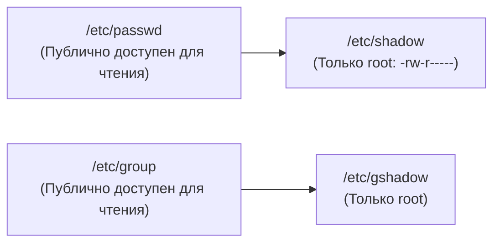

# Модуль 02: Пользователи, группы и модель разграничения прав доступа

## 1. Идентификация пользователей и групп в Linux

Linux является строго многопользовательской операционной системой. Каждое действие в системе выполняется от имени определенного субъекта (User) с определенным набором прав (Group).

### Диапазоны идентификаторов (UID / GID)
- **UID 0 (`root`)**: Суперпользователь. Обладает абсолютными привилегиями, обходит стандартные проверки прав доступа файловой системы (DAC).
- **UID 1 — 999 (или 499 в старых дистрибутивах)**: Системные псевдопользователи (`nobody`, `daemon`, `nginx`, `systemd-resolve`). Не предназначены для интерактивного входа (shell: `/usr/sbin/nologin` или `/bin/false`). Используются для изоляции демонов.
- **UID 1000 — 60000+**: Обычные пользователи системы.

---

## 2. Базы данных пользователей и паролей

Информация об учетных записях хранится в текстовых базах данных в `/etc`:



### Структура `/etc/passwd`
Каждая строка описывает одного пользователя и состоит из 7 полей, разделенных двоеточием:
`username:password:UID:GID:GECOS:home_directory:shell`

```text
kodoku:x:1000:1000:Kodoku Admin,,,:/home/kodoku:/bin/bash
```
- `x` — индикатор того, что хэш пароля вынесен в защищенный файл `/etc/shadow`.
- `GECOS` — комментарий (полное имя, телефон, отдел).

### Структура `/etc/shadow`
Файл содержит хэшированные пароли с солью (salt) и параметры политики устаревания:
`username:$6$salt$hash:lastchange:min:max:warn:inactive:expire:reserved`

- **Алгоритмы хэширования в Linux**:
  - `$1$` — MD5 (устаревший, небезопасный)
  - `$5$` — SHA-256
  - `$6$` — SHA-512 (стандарт в RHEL 7/8, Ubuntu)
  - `$y$` — yescrypt (современный стойкий алгоритм, принят в Debian 12 / Ubuntu 22.04+)

---

## 3. Базовая модель прав доступа (Discretionary Access Control — DAC)

Каждый объект файловой системы имеет владельца-пользователя (User/Owner), группу-владельца (Group) и категорию «остальные» (Others).

### Таблица битов прав доступа
| Право | Символ | Число | Значение для обычного файла | Значение для директории |
| :--- | :---: | :---: | :--- | :--- |
| Read | `r` | 4 | Чтение содержимого файла | Просмотр списка файлов (`ls`) |
| Write | `w` | 2 | Изменение содержимого файла | Создание и удаление файлов внутри каталога |
| Execute | `x` | 1 | Запуск файла как программы | Вход в каталог (`cd`), доступ к метаданным файлов |

> ⚠️ **Критически важно**: Право на удаление файла определяется правами на запись (`w`) в **родительский каталог**, а НЕ правами на сам файл!

### Вычисление прав и маска `umask`
При создании файлов ядро присваивает базовые права:
- Для файлов: `666` (`rw-rw-rw-`)
- Для директорий: `777` (`rwxrwxrwx`)

Итоговые права вычисляются побитовым вычитанием маски процесса `umask`:
`Итоговые права = Базовые права & (~umask)`

Пример со стандартным umask `022`:
- Файл: `666 - 022 = 644` (`-rw-r--r--`)
- Директория: `777 - 022 = 755` (`drwxr-xr-x`)

Для более строгой безопасности серверов часто задают umask `027` (группа может читать, others не имеют доступа вовсе).

---

## 4. Специальные биты прав (SUID, SGID, Sticky Bit)

| Бит | Числовой модификатор | Отображение в `ls -l` | Поведение на файле | Поведение на директории |
| :--- | :---: | :---: | :--- | :--- |
| **SUID** (Set UID) | `4000` | `-rwsr-xr-x` (вместо `x` у владельца) | Процесс исполняется с привилегиями **владельца файла** (пример: `/usr/bin/passwd` принадлежит root) | Игнорируется ядром Linux |
| **SGID** (Set GID) | `2000` | `-rwxr-sr-x` (вместо `x` у группы) | Процесс исполняется с привилегиями группы-владельца | **Все вновь создаваемые файлы и поддиректории наследуют группу родителя!** (Must-have для общих папок) |
| **Sticky Bit** | `1000` | `drwxrwxrwt` (вместо `x` у others) | В современных ядрах не используется | **Удалить или переименовать файл может ТОЛЬКО владелец файла или root!** (Используется в `/tmp`) |

```bash
# Установка SGID на каталог проекта:
chmod 2775 /var/shared_project
# или
chmod g+s /var/shared_project

# Установка Sticky bit:
chmod 1777 /var/public_drop
# или
chmod +t /var/public_drop
```

---

## 5. Списки контроля доступа (POSIX ACLs)

Когда стандартной троицы `Owner - Group - Others` недостаточно (например, нужно дать пользователю `auditor` доступ только на чтение к закрытой директории разработчиков), используются POSIX списки контроля доступа:

- `getfacl /path/to/dir` — просмотр расширенных прав.
- `setfacl -m u:alice:rw- file.txt` — предоставить пользователю alice права `rw-`.
- `setfacl -m g:finance:r-x /data` — предоставить группе finance права `r-x`.
- `setfacl -d -m g:devs:rwx /data` — задать **дефолтные (default)** ACL, которые будут автоматически наследоваться новыми созданными файлами.
- `setfacl -x u:alice file.txt` — удалить правило для пользователя.
- `setfacl -b file.txt` — удалить все расширенные ACL (сброс к базовому DAC).

*Файлы с установленными ACL помечаются знаком плюса `+` в конце строки прав в выводе `ls -l`:*
`-rw-rw-r--+ 1 root root 1024 Oct 5 10:00 secure.dat`

---

## 6. Делегирование полномочий: Утилита `sudo` и файл `/etc/sudoers`

Утилита `sudo` (SuperUser Do) позволяет выполнять команды от имени суперпользователя без передачи постоянного пароля root.

### Безопасное редактирование:
Никогда не редактируйте `/etc/sudoers` обычным текстовым редактором напрямую! Всегда используйте:
```bash
sudo visudo
# или для drop-in файлов:
sudo visudo -f /etc/sudoers.d/99-custom-rules
```
`visudo` блокирует файл от одновременных изменений и валидирует синтаксис перед сохранением, предотвращая блокировку доступа ко всей системе.

### Синтаксис правила:
`Пользователь Хост = (За кого запускать : Группа) [Параметры] Команды`

Примеры:
```sudoers
# Разрешить администраторам группы wheel выполнять любые команды
%wheel ALL=(ALL:ALL) ALL

# Разрешить инженеру поддержки перезапускать только веб-сервер без ввода пароля:
support_user ALL=(root) NOPASSWD: /bin/systemctl restart nginx, /bin/systemctl status nginx

# Использование псевдонимов (Aliases):
User_Alias DEVOPS_TEAM = alex, elena, dmitry
Cmnd_Alias DOCKER_CMNDS = /usr/bin/docker, /usr/bin/docker-compose
DEVOPS_TEAM ALL=(root) DOCKER_CMNDS
```


---

## 7. Векторы эскалации привилегий (Privilege Escalation Vectors)

### 1. Подсистема Linux Capabilities (Альтернатива полному SUID)
Традиционно в Unix процессы делятся на привилегированные (UID 0) и непривилегированные. Подсистема **Capabilities** разделяет монолитную власть root на независимые дискретные полномочия:

| Возможность (Capability) | Разрешенное системное действие | Риск безопасности при ошибочном назначении |
| :--- | :--- | :--- |
| `CAP_SETUID` | Вызов системных функций `setuid()`, изменение собственного UID | Позволяет процессу мгновенно переключить UID на 0 (полный root) |
| `CAP_DAC_READ_SEARCH` | Обход всех проверок прав на чтение файлов и каталогов | Позволяет прочитать `/etc/shadow`, приватные SSH ключи root |
| `CAP_NET_RAW` | Создание RAW и PACKET сетевых сокетов | Непривилегированный сниффинг трафика (пароли, сессии) |
| `CAP_SYS_ADMIN` | Монтирование ФС, загрузка модулей, отладка | Фактический эквивалент root-доступа |

```bash
# Поиск всех файлов в системе с назначенными capabilities:
getcap -r / 2>/dev/null

# Пример опасного назначения:
# sudo setcap cap_setuid+ep /usr/bin/python3
# Эксплуатация:
# python3 -c 'import os; os.setuid(0); os.system("/bin/bash")'
```

### 2. Атака на относительные пути в SUID-программах (PATH Hijacking)
Если бинарный файл с битом SUID вызывает другую системную утилиту без указания абсолютного пути (например, `system("service nginx status")` вместо `/usr/sbin/service`):
1. Атакующий создает в текущей директории вредоносный исполняемый файл с именем вызываемой утилиты (`service`):
   ```bash
   cat << 'EOF' > /tmp/service
   #!/bin/bash
   cp /bin/bash /tmp/root_shell && chmod 4755 /tmp/root_shell
   EOF
   chmod +x /tmp/service
   ```
2. Модифицирует переменную `PATH` так, чтобы текущая директория проверялась первой:
   ```bash
   export PATH="/tmp:$PATH"
   ```
3. При запуске SUID-бинарника ядро находит и выполняет `/tmp/service` с привилегиями владельца бинарника (root)!

### 3. Эксплуатация Sudoers: `env_keep` и `LD_PRELOAD`
Если в `/etc/sudoers` для пользователя или группы разрешено сохранение переменной окружения `LD_PRELOAD` через `Defaults env_keep += "LD_PRELOAD"`:
Любой вызов разрешенной утилиты с флагом `LD_PRELOAD=/path/to/hook.so` приведет к инъекции библиотеки в память запускаемого root-процесса и выполнению функции `_init()` от имени суперпользователя.
