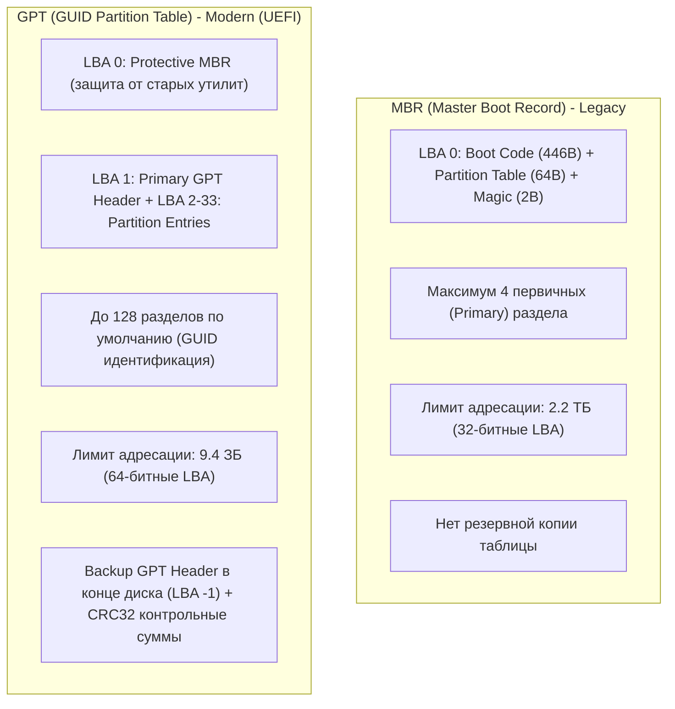
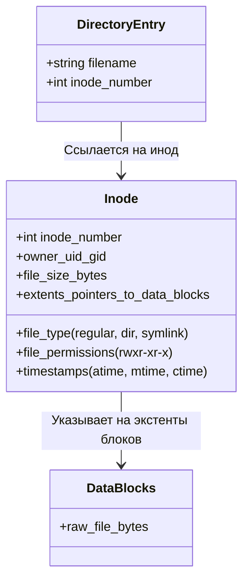
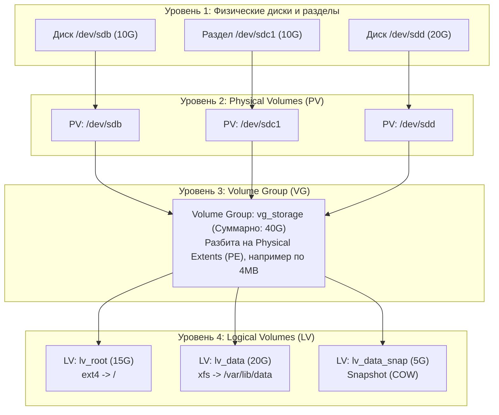
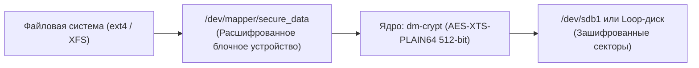

# 💽 Модуль 03: Дисковая подсистема, файловые системы и LVM

> **Цель модуля**: Освоить принципы организации блочных устройств в Linux, научиться выполнять разметку дисков (MBR/GPT), форматировать и тюнить файловые системы (ext4, XFS), управлять точками монтирования через `/etc/fstab`, настраивать область подкачки (Swap) и проектировать гибкую подсистему хранения данных с помощью LVM (Logical Volume Manager).

---

## 1. Архитектура блочных устройств в Linux

В операционных системах Linux все устройства представлены в виде файлов в виртуальной файловой системе `/dev` (Device Files). Устройства хранения данных относятся к классу **блочных устройств** (`block devices`).

```
+-----------------------------------------------------------------------+
|                       Пользовательское пространство                   |
|                        (Приложения, СУБД, Утилиты)                    |
+-----------------------------------------------------------------------+
                                   | Системные вызовы (read, write, sync)
                                   v
+-----------------------------------------------------------------------+
|                                Ядро Linux                             |
|  +-----------------------------------------------------------------+  |
|  |           VFS (Virtual File System / Виртуальная ФС)            |  |
|  +-----------------------------------------------------------------+  |
|          |                         |                        |         |
|          v                         v                        v         |
|  +---------------+         +---------------+        +---------------+ |
|  |     ext4      |         |      XFS      |        |     Btrfs     | |
|  +---------------+         +---------------+        +---------------+ |
|          |                         |                        |         |
|          +-------------------------+------------------------+         |
|                                    |                                  |
|                                    v                                  |
|  +-----------------------------------------------------------------+  |
|  |       LVM / Device Mapper / MD-RAID (Программные абстракции)    |  |
|  +-----------------------------------------------------------------+  |
|                                    |                                  |
|                                    v                                  |
|  +-----------------------------------------------------------------+  |
|  |       I/O Scheduler (Планировщик ввода-вывода: mq-deadline, bfq)|  |
|  +-----------------------------------------------------------------+  |
|                                    |                                  |
|                                    v                                  |
|  +-----------------------------------------------------------------+  |
|  |            Драйверы блочных устройств (SCSI, NVMe, VirtIO)      |  |
|  +-----------------------------------------------------------------+  |
+-----------------------------------------------------------------------+
                                   |
                                   v
+-----------------------------------------------------------------------+
|                             Аппаратный уровень                        |
|             (NVMe SSD, SATA SSD/HDD, SAN/iSCSI LUN, Loop-диски)       |
+-----------------------------------------------------------------------+
```

### Именование блочных устройств
Имена формируются ядром в зависимости от шины и типа контроллера:
* `/dev/sd[a-z]` — SCSI, SATA, SAS накопители или USB-флешки (например, `/dev/sda` — первый диск, `/dev/sdb` — второй). Разделы обозначаются цифрами: `/dev/sda1`, `/dev/sda2`.
* `/dev/nvme[0-9]n[0-9]` — высокоскоростные накопители NVMe (Non-Volatile Memory Express). Пример: `/dev/nvme0n1` — первый диск первого контроллера, а раздел — `/dev/nvme0n1p1`.
* `/dev/vd[a-z]` — виртуальные диски гипервизоров KVM/QEMU (VirtIO block driver).
* `/dev/loop[0-9]` — псевдоустройства (loop devices), позволяющие монтировать обычные файлы как блочные накопители.

### Идентификация и исследование блочных устройств
Для безопасной работы системный администратор должен уметь быстро инспектировать топологию дисков:

```bash
# Дерево блочных устройств с размерами, точками монтирования и типами ФС
lsblk -f

# Получение UUID, типов файловых систем и меток всех разделов
blkid

# Информация о дисках на уровне ядра через sysfs
cat /sys/block/sda/queue/rotational  # 0 = SSD/NVMe, 1 = HDD (вращающийся)
cat /sys/block/sda/queue/scheduler   # текущий планировщик ввода-вывода
```

---

## 2. Разметка дисков: MBR vs GPT

Перед созданием файловой системы физический или виртуальный диск должен быть размечен. Существуют два стандарта таблиц разделов: **MBR** и **GPT**.



### Сравнительная таблица MBR и GPT

| Характеристика | MBR (Master Boot Record) | GPT (GUID Partition Table) |
| :--- | :--- | :--- |
| **Год появления** | 1983 (PC DOS 2.0) | 1999 (спецификация EFI / UEFI) |
| **Максимальный объем диска** | 2.2 ТБ (при размере сектора 512 байт) | 9.4 ЗБ ($9.4 \times 10^{21}$ байт) |
| **Количество разделов** | До 4 Primary (или 3 Primary + 1 Extended с логическими) | 128 разделов (по стандарту, можно увеличить) |
| **Надежность / Избыточность** | Отсутствует (повреждение сектора 0 фатально) | Резервная копия заголовка в конце диска, CRC32 |
| **Идентификация разделов** | 1-байтный Partition Type (напр. `83` Linux, `8e` LVM) | 128-битный уникальный UUID (GUID) |
| **Режим загрузки BIOS/UEFI** | Legacy BIOS | UEFI (или Legacy BIOS через Bios Boot Partition) |
| **Рекомендуемые утилиты** | `fdisk` | `gdisk`, `parted`, modern `fdisk` |

### Практическая работа с утилитами разметки

* **`fdisk`**: Интерактивная утилита. В современных версиях (util-linux) полностью поддерживает GPT:
  * `m` — справка по командам;
  * `g` — создать новую пустую таблицу GPT;
  * `o` — создать новую пустую таблицу MBR;
  * `n` — создать новый раздел;
  * `p` — вывести текущую таблицу разделов;
  * `t` — изменить тип раздела (например, на `Linux LVM`);
  * `w` — записать изменения на диск и выйти;
  * `q` — выйти без сохранения.
* **`parted`**: Скриптуемая утилита, удобная для автоматизации (IaC, Kickstart, Cloud-init):
  ```bash
  # Создание GPT таблицы разделов
  parted -s /dev/sdb mklabel gpt
  
  # Создание раздела размером 10 ГБ под ext4
  parted -s /dev/sdb mkpart primary ext4 1MiB 10GiB
  
  # Выравнивание разделов критично для SSD (1MiB alignment)!
  ```
* **Применение изменений без перезагрузки**:
  Если диск уже использовался ядром, после изменения разметки ядро необходимо уведомить об изменении таблицы разделов:
  ```bash
  partprobe /dev/sdb
  # или
  udevadm settle
  ```

---

## 3. Файловые системы: ext4 и XFS

Файловая система отвечает за преобразование линейного пространства секторов диска в древовидную структуру каталогов и файлов. В Enterprise Linux доминируют две ФС: **ext4** (стандарт в Debian/Ubuntu) и **XFS** (стандарт по умолчанию в RHEL/CentOS/Rocky/Alma Linux).



### Архитектурные различия: Inode и Data Blocks
1. **Имя файла НЕ хранится в Inode!** Каталог в Linux — это специальный файл, содержащий список пар: `[Имя файла -> Номер Inode]`.
2. **Hard Link (Жесткая ссылка)** — это еще одна запись в каталоге, указывающая на тот же номер Inode. Файл удаляется с диска только тогда, когда счетчик жестких ссылок (`links count`) становится равен 0 и закрыты все файловые дескрипторы.
3. **Soft Link (Символическая ссылка)** — отдельный файл с собственным инодом, содержимым которого является путь к целевому файлу.

### Сравнение ext4 vs XFS

| Параметр | ext4 (Fourth Extended Filesystem) | XFS (High-Performance 64-bit FS) |
| :--- | :--- | :--- |
| **Архитектура инодов** | Фиксированное количество инодов создается при форматировании (`mkfs.ext4 -N`) | Динамическое выделение инодов по мере необходимости |
| **Максимальный размер ФС** | 1 EiB ($10^{18}$ байт) | 8 EiB |
| **Максимальный размер файла** | 16 TiB | 8 EiB |
| **Увеличение (Grow / Expand)** | Поддерживается online (на лету): `resize2fs` | Поддерживается online (на лету): `xfs_growfs` |
| **Уменьшение (Shrink)** | Поддерживается **только offline** (при демонтированной ФС): `resize2fs` | **НЕ ПОДДЕРЖИВАЕТСЯ принципиально!** XFS нельзя уменьшить |
| **Журналирование (Journaling)** | `data=journal`, `data=ordered` (default), `data=writeback` | Журнал метаданных (высокая производительность при параллельной записи) |
| **Восстановление и чек** | `e2fsck / fsck.ext4` | `xfs_repair` (утилиты fsck для XFS — заглушки) |
| **Область применения** | Десктопы, малые/средние хранилища, разделы с миллионами мелких файлов | Enterprise СУБД, Big Data, массивы дисков, медиахранилища |

### Команды создания и тюнинга ФС

```bash
# Форматирование в ext4 с меткой диска
mkfs.ext4 -L "DATA_STORE" /dev/sdb1

# Тюнинг ext4: отключение резерва 5% root-пространства для раздела данных
tune2fs -m 0 /dev/sdb1

# Форматирование в XFS с включенным reflink (copy-on-write снимки файлов)
mkfs.xfs -f -m reflink=1 -L "APP_STORAGE" /dev/sdb2

# Проверка целостности ext4 (раздел ОБЯЗАН быть отмонтирован!)
umount /mnt/data && e2fsck -f /dev/sdb1

# Проверка и починка XFS (раздел ОБЯЗАН быть отмонтирован!)
umount /mnt/app && xfs_repair /dev/sdb2
```

---

## 4. Монтирование и управление `/etc/fstab`

Монтирование — процесс подключения файловой системы накопителя к определенной директории (точке монтирования, mount point) в общем дереве VFS.

```bash
# Ручное монтирование
mount -t ext4 -o noexec,nosuid /dev/sdb1 /mnt/data

# Просмотр смонтированных систем
findmnt
# или
mount | grep sdb
```

### Анатомия файла `/etc/fstab`
Файл `/etc/fstab` считывается при загрузке системы (генератором `systemd-fstab-generator`, который создает динамические `.mount` юниты). Ошибка в синтаксисе или недоступность диска без флага `nofail` приведет к падению ОС в **Emergency Mode** (аварийный шелл).

Каждая строка содержит строго 6 полей, разделенных пробелами или табуляциями:

```
[Поле 1: Устройство]              [Поле 2: Точка]   [Поле 3: ФС] [Поле 4: Опции]             [Поле 5: Dump] [Поле 6: Pass]
UUID=4f3b7d1a-821b-41a3-a7c5...   /var/log          ext4        defaults,noatime,nodev      0              2
/dev/mapper/vg_data-lv_app         /opt/app          xfs         defaults,nofail             0              0
/swapfile                          none              swap        sw                          0              0
```

1. **Устройство (Device)**:
   * **КРАЙНЕ РЕКОМЕНДУЕТСЯ**: `UUID=xxxx-xxxx` (постоянный идентификатор раздела) или `LABEL=xxxx`.
   * **НЕ РЕКОМЕНДУЕТСЯ в продакшене**: `/dev/sdb1` (при добавлении дисков или перезагрузке порядок шины SCSI может измениться, и `/dev/sdb` станет `/dev/sdc`).
   * Для LVM: допустимо `/dev/mapper/vgname-lvname` или `/dev/vgname/lvname`.
2. **Точка монтирования (Mount Point)**: абсолютный путь к каталогу (для swap указывается `none`).
3. **Тип файловой системы (FS Type)**: `ext4`, `xfs`, `vfat`, `swap`, `iso9660`, `nfs`.
4. **Опции монтирования (Mount Options)**:
   * `defaults`: стандартный набор (`rw, suid, dev, exec, auto, nouser, async`).
   * `noatime`: запрет обновления времени последнего доступа к файлам при чтении (сильно снижает нагрузку на SSD и базы данных).
   * `nodev`: запрет интерпретации блочных/символьных устройств на этом разделе.
   * `nosuid`: игнорирование битов SUID/SGID (критично для безопасности `/tmp`, `/var/tmp`, пользовательских шар).
   * `noexec`: запрет прямого исполнения бинарных файлов на разделе.
   * `nofail`: **критичная опция** для внешних или вторичных дисков! Если диск отсутствует или поврежден, загрузка системы **не прервется**.
   * `_netdev`: указывает, что устройство является сетевым (iSCSI, NFS), и монтировать его нужно только после поднятия сети.
5. **Dump (Резервное копирование)**: Устаревшее поле для утилиты `dump`. В 99.9% случаев устанавливается в `0`.
6. **Pass (Порядок проверки `fsck` при старте)**:
   * `1` — корневой раздел `/` (проверяется первым).
   * `2` — остальные локальные разделы ext4.
   * `0` — проверка отключена (всегда указывать для `XFS`, `swap`, сетевых ФС и CD/DVD).

> **Золотое правило сисадмина**:  
> После любого редактирования `/etc/fstab` **НИКОГДА** не перезагружайте сервер, не выполнив тест:
> ```bash
> mount -a
> ```
> Если команда завершилась без ошибок, все записи валидны. Если в fstab допущена синтаксическая ошибка, `mount -a` сразу выведет предупреждение.

---

## 5. Подкачка (Swap Space): Разделы и Swap-файлы

Память подкачки (Swap) используется ядром Linux для сброса неактивных страниц анонимной памяти (RAM) при нехватке физической оперативной памяти, а также для механизмов гибернации.

```bash
# Проверка текущего состояния swap
swapon --show
free -h
```

### Сравнение: Swap Partition vs Swap File
* **Swap-раздел**: классический подход, выделенный raw-раздел диска. Чуть меньше накладных расходов в старых версиях ядра. Минус — сложно изменить размер без переразметки.
* **Swap-файл**: современный стандарт (по умолчанию в Ubuntu, Fedora). Файл выделяется прямо на существующей ФС (`ext4` или `xfs`). Легко создается, расширяется и удаляется за секунды.

### Создание Swap-файла безопасным способом:
```bash
# 1. Выделение непрерывного блока памяти 2 ГБ через fallocate или dd
fallocate -l 2G /swapfile
# Если ФС не поддерживает fallocate (напр. старые версии XFS):
# dd if=/dev/zero of=/swapfile bs=1M count=2048 status=progress

# 2. Установка строгих прав доступа (только root!)
chmod 600 /swapfile

# 3. Инициализация сигнатуры swap
mkswap /swapfile

# 4. Активация swap
swapon /swapfile

# 5. Добавление в /etc/fstab для автозагрузки
# /swapfile none swap sw 0 0
```

### Параметр `vm.swappiness`
Определяет агрессивность ядра при вытеснении анонимной памяти в swap:
* Диапазон: от `0` до `200` (в современных ядрах, исторически до `100`).
* Значение `60`: стандарт для десктопов и типовых серверов.
* Значение `10` или `1`: рекомендуется для высоконагруженных баз данных (PostgreSQL, Redis, Elasticsearch), чтобы минимизировать дисковый I/O.
* Значение `0`: вытеснение страниц в swap только при угрозе OOM (Out-Of-Memory).

Изменение на лету и персистентно:
```bash
sysctl vm.swappiness=10
echo "vm.swappiness=10" >> /etc/sysctl.d/99-sysctl.conf
```

---

## 6. LVM (Logical Volume Manager)

LVM — это уровень абстракции между физическими накопителями и файловыми системами. LVM позволяет объединять разрозненные диски в единый пул, создавать логические тома произвольного размера, расширять их на лету без перезагрузок и создавать мгновенные снимки (snapshots).



### Архитектурные компоненты LVM
1. **Physical Volume (PV)**: Физический диск или раздел (с типом `8e` в MBR или `8e00` в GPT), инициализированный LVM метаданными (`pvcreate`).
2. **Physical Extent (PE)**: Минимальный неделимый блок дискового пространства в LVM (по умолчанию 4 МБ). Вся память VG выделяется квантами PE.
3. **Volume Group (VG)**: Пул хранения, объединяющий один или несколько PV в единое адресное пространство.
4. **Logical Volume (LV)**: Логический раздел, создаваемый внутри VG. Для операционной системы он выглядит как обычное блочное устройство (`/dev/mapper/vgname-lvname` или `/dev/vgname/lvname`).
5. **Logical Extent (LE)**: Логический эквивалент PE. Каждый LE мапится на конкретный PE.

### Справочник команд LVM

| Задача | Уровень PV | Уровень VG | Уровень LV |
| :--- | :--- | :--- | :--- |
| **Создание** | `pvcreate /dev/sdb` | `vgcreate vg_data /dev/sdb` | `lvcreate -L 10G -n lv_app vg_data` |
| **Просмотр (кратко)** | `pvs` | `vgs` | `lvs` |
| **Просмотр (детально)** | `pvdisplay` | `vgdisplay` | `lvdisplay` |
| **Расширение** | `pvresize /dev/sdb` | `vgextend vg_data /dev/sdc` | `lvextend -L +5G /dev/vg_data/lv_app` |
| **Уменьшение** | — | `vgreduce vg_data /dev/sdc` | `lvreduce -L -5G /dev/vg_data/lv_app` *(Опасно!)* |
| **Удаление** | `pvremove /dev/sdb` | `vgremove vg_data` | `lvremove /dev/vg_data/lv_app` |

### Практика: Онлайн-расширение логического тома (Online Resize)
В реальном продакшене одна из самых частых задач сисадмина — добавить места на переполненный том без простоя сервиса.

```bash
# Шаг 1. Расширение самого логического тома на +10 ГБ
# Ключ -r (--resizefs) автоматически вызовет соответствующую утилиту ФС (resize2fs или xfs_growfs)!
lvextend -r -L +10G /dev/mapper/vg_data-lv_app

# Если флаг -r не использовался, ФС расширяется вручную:
# Для ext4 (онлайн):
resize2fs /dev/mapper/vg_data-lv_app

# Для XFS (онлайн, передается ТОЧКА МОНТИРОВАНИЯ, а не блочное устройство!):
xfs_growfs /var/lib/app
```

### LVM Снимки (Snapshots) и принцип Copy-On-Write (COW)
Снимок (Snapshot) фиксирует состояние логического тома в определенный момент времени. Снимок не копирует все данные сразу; он резервирует место под изменения. При модификации исходного блока данных на оригинальном LV, старая версия блока сохраняется в область COW-снимка.

```bash
# Создание снимка размером 2 ГБ для тома lv_db
lvcreate -L 2G -s -n lv_db_snap /dev/vg_data/lv_db

# Монтирование снимка для снятия консистентного бэкапа:
# (Для XFS требуется опция nouuid, так как UUID тома совпадает со снимком!)
mount -o ro,nouuid /dev/vg_data/lv_db_snap /mnt/snapshot

# Откат изменений к состоянию снимка (Merge):
# 1. Отмонтировать оригинальный том и снимок
umount /mnt/snapshot
umount /var/lib/mysql
# 2. Выполнить слияние (после завершения снимок автоматически удалится)
lvconvert --merge /dev/vg_data/lv_db_snap
# 3. Смонтировать восстановленный том обратно
mount /dev/vg_data/lv_db /var/lib/mysql
```

---

## 7. Подводные камни и Best Practices в Enterprise

1. **Заполнение Inodes при свободном месте на диске**:
   * Симптом: Приложение падает с ошибкой `No space left on device`, однако `df -h` показывает, что на диске свободно 40-70%.
   * Причина: Закончились иноды из-за генерации огромного количества мелких файлов (PHP сессии, кэш, spool письма maildrop).
   * Диагностика: `df -i`.
   * Поиск виновника:
     ```bash
     find /var/spool -xdev -printf '%h\n' | sort | uniq -c | sort -k 1 -nr | head -10
     ```

2. **Фантомная утечка дискового пространства (Unlinked Open Files)**:
   * Симптом: Файл удален командой `rm /var/log/app.log`, но `df -h` по-прежнему показывает 100% заполнения диска.
   * Причина: Процесс (например, сервис логирования или Java) удерживает открытый файловый дескриптор удаленного файла. Место на диске не освободится, пока процесс не закроет дескриптор или не завершится.
   * Диагностика:
     ```bash
     lsof +L1
     # или
     lsof | grep deleted
     ```
   * Решение: Перезапустить процесс, либо безопасно очистить файл через дескриптор:
     ```bash
     > /proc/<PID>/fd/<FD_NUM>
     ```

3. **Сломанный `/etc/fstab` и аварийная перезагрузка**:
   * Ошиблись в UUID или опциях без флага `nofail`? При перезагрузке система остановится в `emergency.target`.
   * Решение в аварийном шелле:
     ```bash
     # Корень часто смонтирован в Read-Only. Перемонтируем в RW:
     mount -o remount,rw /
     # Редактируем /etc/fstab, комментируя проблемную строку
     nano /etc/fstab
     # Проверяем и перезагружаемся
     mount -a
     systemctl reboot
     ```

4. **Попытка уменьшить XFS**:
   * Попытка выполнить `lvreduce` на томе с файловой системой XFS приведет к **необратимому разрушению метаданных и потере данных**. XFS спроектирована исключительно с поддержкой онлайн-роста. Если том XFS необходимо уменьшить, единственный путь: сделать резервную копию файлов (`tar`/`rsync`), пересоздать том меньшего размера, отформатировать заново и вернуть файлы из бэкапа.


---

## 8. Безопасность накопителей, шифрование LUKS2 и цифровая форензика

### 1. Полнодисковое шифрование LUKS2 / dm-crypt
В корпоративной среде физическая кража сервера, дисков или накопителей на утилизации несет критический риск утечки персональных данных и закрытых ключей. Стандартом шифрования блочных устройств в Linux является **LUKS (Linux Unified Key Setup)** на базе подсистемы ядра `dm-crypt`:



```bash
# Инициализация тома LUKS2:
cryptsetup luksFormat --type luks2 /dev/loop1

# Открытие зашифрованного тома с вводом пароля или ключа:
cryptsetup open /dev/loop1 secure_vault

# Создание ФС поверх расшифрованного отображения:
mkfs.ext4 /dev/mapper/secure_vault
mount /dev/mapper/secure_vault /mnt/secure_vault

# Закрытие тома после работы:
umount /mnt/secure_vault
cryptsetup close secure_vault
```

### 2. Утечка учетных данных через Swap (Memory-to-Disk Leakage)
Если область подкачки (Swap) не зашифрована, ядро при нехватке оперативной памяти сбрасывает страницы процессов на диск. В дампе swap остаются:
- Пароли пользователей в открытом виде.
- Приватные SSL/TLS сертификаты.
- Токены доступа и ключи сессий.
**Форензик-анализ Swap**:
`strings /dev/mapper/vg0-swap | grep -iE 'password|bearer|authorization' | head -n 30`
**Защита**: Настройка шифрования swap через `/etc/crypttab` с генерацией случайного одноразового ключа при каждой загрузке (`/dev/urandom`).

### 3. Защита от несанкционированной модификации: Неизменяемые файлы (`chattr +i`)
Атрибуты файловой системы ext4/XFS позволяют блокировать модификацию критических файлов даже для суперпользователя `root`:
- `chattr +i /etc/passwd /etc/shadow` — установка флага Immutability. Файл невозможно удалить, переименовать, перезаписать или создать на него симлинк, пока флаг не снят.
- `chattr +a /var/log/audit/audit.log` — флаг Append-Only. В файл разрешено только дописывать данные в конец, удаление и перезапись строк запрещены.
- Просмотр установленных флагов: `lsattr /etc/passwd`.
