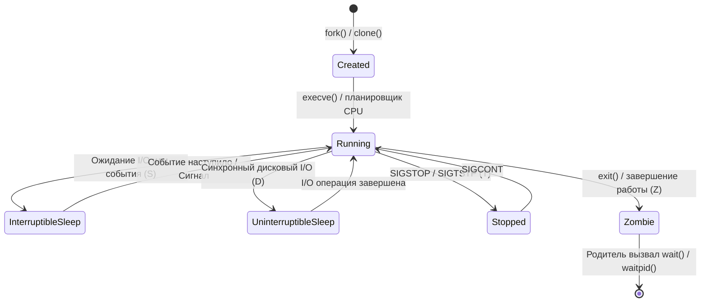
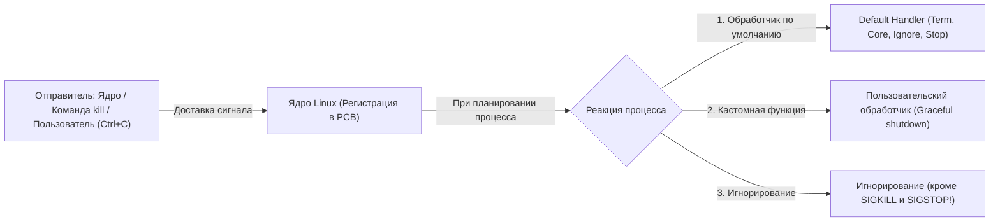
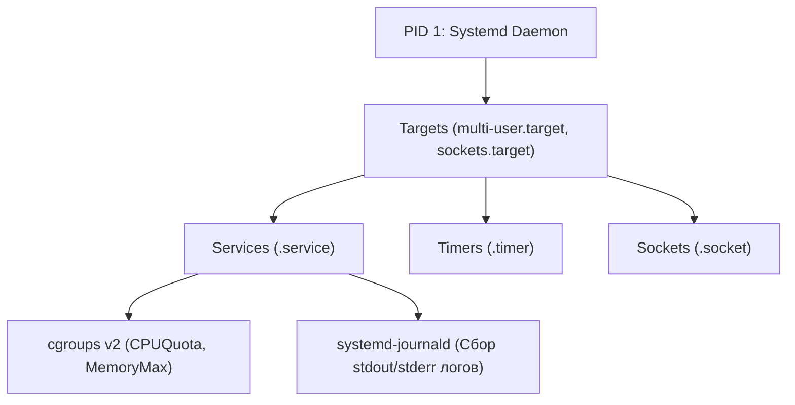
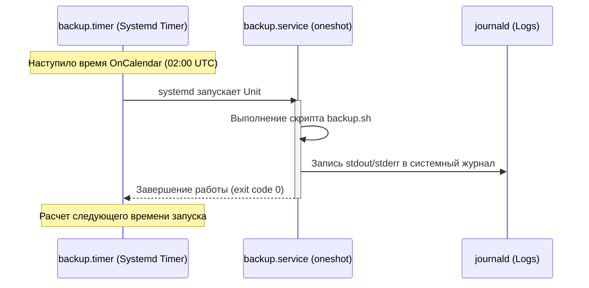

# ⚙️ Модуль 04: Управление процессами и Systemd

> **Цель модуля**: Освоить архитектуру управления процессами в Linux, глубоко изучить жизненный цикл, механизм передачи сигналов (POSIX signals) и приоритеты планировщика. Досконально разобрать системный менеджер **Systemd**: разработку и харденинг Unit-файлов сервисов, замену crontab на systemd timers, сокетную активацию и расследование системных инцидентов с помощью `journalctl`.

---

## 1. Жизненный цикл процессов в Linux

Процесс — это выполняющийся экземпляр программы, которому ядро выделяет изолированное виртуальное адресное пространство, дескрипторы открытых файлов, стек, кучу, переменные окружения и метаданные безопасности (UID/GID, Capabilities, SELinux context).



### Системные вызовы порождения процессов
1. **`fork()` / `clone()`**: Создает почти точную копию родительского процесса (Child). Память родителя не дублируется физически мгновенно благодаря механизму **Copy-On-Write (COW)** — страницы памяти помечаются как read-only и копируются ядром только тогда, когда один из процессов пытается в них записать.
2. **`execve()`**: Заменяет текущий образ процесса (код, стек, данные) новой исполняемой программой с диска. PID при этом сохраняется!
3. **`wait()` / `waitpid()`**: Родительский процесс считывает статус завершения и код возврата (exit code) своего дочернего процесса.

### Иерархия процессов и PID 1
Дерево процессов в Linux строго иерархично:
* Корень дерева — **PID 1** (`/sbin/init`, в современных дистрибутивах это `systemd`). Ядро запускает PID 1 первым при загрузке.
* Каждый процесс хранит идентификатор родителя: **PPID (Parent Process ID)**.
* **Orphan Processes (Процессы-сироты)**: Если родитель завершается раньше дочернего процесса, ядро автоматически "усыновляет" потомка процессом PID 1 (или ближайшим суб-репером), который берет на себя вызов `wait()`.
* **Zombie Processes (Зомби, `[defunct]`)**: Состояние процесса, который уже выполнил `exit()`, освободил свою память и закрыл файлы, но родитель еще **не вызвал `wait()`**. В таблице процессов ядра сохраняется минимальная запись (PID, статус завершения, статистика ресурсов).
  > **Важно**: Зомби-процесс **НЕ потребляет CPU и RAM**. Однако он занимает слот в таблице дескрипторов ядра. Если лимит `kernel.pid_max` будет исчерпан зомби-процессами, система не сможет запустить ни один новый процесс!
  > Зомби **нельзя убить командой `kill -9`**, потому что процесс уже мертв. Устранить зомби можно только заставив родителя вызвать `wait()`, либо завершив родительский процесс (тогда зомби усыновит PID 1 и мгновенно очистит).

### Состояния процессов (Process States в `ps` / `top`)
* **`R` (Running / Runnable)**: процесс выполняется на CPU прямо сейчас или находится в очереди готовности планировщика.
* **`S` (Interruptible Sleep)**: процесс спит, ожидая ресурса (сокет, пайп, таймер). Может быть мгновенно разбужен любым сигналом.
* **`D` (Uninterruptible Sleep)**: процесс заблокирован в ожидании низкоуровневого аппаратного I/O (чтение блока с диска, ответ от зависшего NFS-сервера).
  > **Подводный камень**: Процессы в состоянии `D` **НЕЛЬЗЯ ПРЕРВАТЬ**. Они игнорируют даже `kill -9 SIGKILL`! Если диск завис, процесс в D-state останется в системе до перезагрузки или аппаратного ответа шины.
* **`T` (Stopped / Traced)**: процесс приостановлен по сигналу `SIGSTOP` (или `Ctrl+Z`), либо находится под отладчиком `gdb`/`strace`.
* **`Z` (Zombie / Defunct)**: завершился, ждет считывания статуса родителем.

---

## 2. Сигналы Linux (POSIX Signals)

Сигналы — это асинхронные уведомления, отправляемые ядром процессу при возникновении определенного системного события или по запросу другого процесса.



### Таблица ключевых сигналов Linux

| Номер | Имя | Действие по умолчанию | Перехват (Catch) | Описание и применение |
| :---: | :--- | :--- | :---: | :--- |
| **1** | `SIGHUP` | Завершение процесса | Да | Разрыв терминала (Hangup). В демонах используется как сигнал **перечитать конфигурацию без перезапуска** (Reload config). |
| **2** | `SIGINT` | Завершение процесса | Да | Прерывание с клавиатуры (`Ctrl+C`). Мягкая просьба остановиться. |
| **3** | `SIGQUIT`| Аварийное завершение + Core Dump | Да | Выход с генерацией дампа памяти (`Ctrl+\`). |
| **9** | `SIGKILL`| Мгновенное уничтожение | **НЕТ** | Немедленное снятие процесса ядром. Процесс не может сохранить данные или закрыть сокеты. |
| **10**| `SIGUSR1`| Завершение процесса | Да | Пользовательский сигнал 1 (в Nginx: ротация логов). |
| **12**| `SIGUSR2`| Завершение процесса | Да | Пользовательский сигнал 2 (в Nginx: бесшовное обновление бинарника). |
| **15**| `SIGTERM`| Завершение процесса | Да | **Стандартный сигнал остановки** (используется `kill`, `systemctl stop`, `docker stop`). Дает процессу время на закрытие транзакций и соединений (Graceful Shutdown). |
| **17**| `SIGCHLD`| Игнорирование | Да | Уведомление родителю о том, что дочерний процесс изменил состояние или завершился. |
| **18**| `SIGCONT`| Продолжение работы | Да | Возобновить выполнение процесса, остановленного по `SIGSTOP`. |
| **19**| `SIGSTOP`| Приостановка процесса | **НЕТ** | Заморозка выполнения ядром. Нельзя перехватить или проигнорировать. |

### Утилиты отправки сигналов
```bash
# Отправка SIGTERM (по умолчанию, сигнал 15) по PID
kill 1234

# Отправка SIGKILL (сигнал 9)
kill -9 1234
kill -SIGKILL 1234

# Перечитывание конфига (сигнал 1)
kill -HUP 1234

# Завершение процессов по имени
killall -SIGTERM nginx
pkill -u student -f "python3 mock_daemon"

# Поиск PID процессов по шаблону имени
pgrep -l -u student python3
```

---

## 3. Приоритеты, планировщик и OOM Killer

### Приоритеты процессов (Nice Value)
Планировщик Linux (CFS — Completely Fair Scheduler / EEVDF в ядрах 6.6+) распределяет кванты процессорного времени на основе приоритета процесса.

* Диапазон **Nice**: от **`-20`** (наивысший приоритет, максимальная доля CPU) до **`+19`** (наименьший приоритет, процесс уступает CPU всем остальным).
* Обычный непривилегированный пользователь может **только повышать** значение nice (делать процесс "более вежливым", т.е. понижать его приоритет).
* Только `root` может назначать отрицательные значения (от -1 до -20).

```bash
# Запуск команды с пониженным приоритетом (+10)
nice -n 10 tar -czf backup.tar.gz /var/data/

# Изменение приоритета уже работающего процесса
renice -n -5 -p 1234
```

### OOM Killer (Out-Of-Memory Killer)
Когда в системе заканчивается физическая оперативная память и пространство Swap, ядро запускает механизм OOM Killer, который принудительно завершает процесс, потребляющий больше всего ресурсов и представляющий наименьшую ценность для стабильности ОС.

Ядро вычисляет рейтинг для каждого процесса:
* `/proc/<PID>/oom_score` — число от 0 до 1000. Чем выше балл, тем выше шанс быть уничтоженным.
* `/proc/<PID>/oom_score_adj` — корректировка от `-1000` до `+1000`.

> **Enterprise практика**:  
> Критически важные сервисы (СУБД, SSH) защищают от OOM Killer:
> ```bash
> # Запрет OOM Killer трогать процесс (полный иммунитет)
> echo -1000 > /proc/<PID>/oom_score_adj
> ```
> В Systemd это настраивается декларативно директивой `OOMScoreAdjust=-1000`.

---

## 4. Диагностика процессов и метрики системы

### Псевдофайловая система `/proc`
Каждый процесс представлен директорией `/proc/<PID>`:
* `/proc/<PID>/cmdline` — аргументы командной строки запуска (разделены null-байтами `\0`).
* `/proc/<PID>/environ` — переменные окружения процесса.
* `/proc/<PID>/status` — подробная статистика (состояние, память VmRSS, UID/GID, маски сигналов).
* `/proc/<PID>/fd/` — симлинки на все открытые процессом файловые дескрипторы (файлы, сокеты, каналы).
* `/proc/<PID>/limits` — soft и hard лимиты процесса (max open files, max processes).

### Мониторинг: `ps`, `top`, Load Average
```bash
# Полный список процессов со структурированными колонками
ps -eo pid,ppid,user,pri,ni,stat,pcpu,pmem,args --sort=-pcpu | head -15

# Дерево процессов
pstree -p
```

### Разбор CPU метрик в `top` / `htop`
* **`%us` (user)**: время выполнения пользовательского кода (приложения, веб-серверы, БД).
* **`%sy` (system)**: время выполнения кода ядра (обработка syscalls, переключение контекста, сеть). Высокий `%sy` часто указывает на аномальное количество мелких операций ввода-вывода или баги драйверов.
* **`%wa` (I/O wait)**: время простоя CPU в ожидании завершения дисковых операций. Высокий `%wa` (>20-30%) — верный признак перегрузки дисковой подсистемы (деградация RAID, нехватка IOPS).
* **`%id` (idle)**: процент простоя процессора.

### Понимание Load Average (LA)
В строке состояния `top` выводятся три числа: средняя длина очереди выполнения за **1 минуту, 5 минут и 15 минут**.
Load Average в Linux учитывает сумму процессов:
$$\text{Load Average} = \text{Процессы в состоянии R (CPU ready)} + \text{Процессы в состоянии D (I/O wait)}$$
* Если на 4-ядерном сервере Load Average = **4.0**, процессор загружен ровно на 100%.
* Если Load Average = **8.0** на 4 ядрах, в очереди на исполнение постоянно ожидает в 2 раза больше задач, чем ядер CPU (система перегружена).
* Если CPU idle = 90%, но Load Average = 15.0 — это означает, что 15 процессов зависли в **состоянии D**, ожидая диск или сеть!

---

## 5. Архитектура Systemd и анатомия Unit-файлов

Systemd — это системный менеджер и диспетчер служб в современных дистрибутивах Linux. Он управляет загрузкой ОС, инициализацией служб, разграничением ресурсов с помощью **cgroups v2**, монтированием дисков, таймерами и сетевыми сокетами.



### Расположение Unit-файлов в файловой системе
1. `/lib/systemd/system/` (или `/usr/lib/systemd/system/`) — системные юниты, установленные пакетным менеджером (не редактировать вручную!).
2. `/etc/systemd/system/` — **каталог администратора**. Файлы здесь имеют наивысший приоритет и переопределяют пакетные юниты.

### Анатомия Unit-файла службы (`.service`)
Типовой юнит состоит из трех основных секций:

```ini
[Unit]
Description=Enterprise Mock Application Daemon
After=network.target network-online.target
Wants=network-online.target

[Service]
Type=simple
User=student
Group=student
WorkingDirectory=/opt/mock_daemon
ExecStart=/usr/bin/python3 /opt/mock_daemon/mock_daemon.py
ExecReload=/bin/kill -HUP $MAINPID
Restart=on-failure
RestartSec=5s
StartLimitIntervalSec=60s
StartLimitBurst=3

# --- Харденинг и безопасность ---
ProtectSystem=strict
ProtectHome=true
NoNewPrivileges=true
PrivateTmp=true
RuntimeDirectory=mock_daemon

# --- Ограничения ресурсов (cgroups v2) ---
CPUQuota=50%
MemoryMax=256M

[Install]
WantedBy=multi-user.target
```

### Разбор директив секции `[Service]`

#### 1. Типы сервисов (`Type=`):
* **`Type=simple`** (по умолчанию): Systemd считает службу запущенной сразу после вызова `fork/exec`. Процесс НЕ должен уходить в фон (демонизироваться). `ExecStart` должен запускать процесс на переднем плане (foreground).
* **`Type=forking`**: Традиционные демоны SysVinit. Родительский процесс делает `fork()` и немедленно завершается, оставляя дочерний процесс работать в фоне. Обязательно указывать `PIDFile=/path/to/pidfile`.
* **`Type=oneshot`**: Для однократных скриптов (например, скрипт бэкапа или очистки кэша). Systemd ждет полного завершения процесса перед тем, как перейти к следующим юнитам.
* **`Type=notify`**: Сервис шлет явное уведомление systemd через сокет (`sd_notify()`), сигнализируя о готовности принимать трафик.

#### 2. Политики перезапуска (`Restart=`):
* `Restart=no` — не перезапускать никогда.
* `Restart=on-failure` — перезапускать только при ненулевом коде возврата или падении по сигналу.
* `Restart=always` — перезапускать всегда при остановке (штатной или аварийной).
* `RestartSec=5s` — задержка перед попыткой рестарта.
* **Защита от циклического падения (CrashLoopBackoff)**:
  * `StartLimitIntervalSec=60s` и `StartLimitBurst=3`: если сервис падает чаще 3 раз за 60 секунд, Systemd прекращает попытки перезапуска и переводит сервис в состояние `failed` (`start-limit-hit`).

#### 3. Безопасность и песочница (Service Hardening):
* `User=` / `Group=` — запуск от имени непривилегированного сервисного пользователя (никогда не запускайте сервисы от `root`, если это не утилита системного уровня!).
* `ProtectSystem=strict` — монтирует `/usr`, `/boot`, `/etc` в режиме Read-Only для сервиса.
* `ProtectHome=true` — закрывает доступ к `/home`, `/root` и `/run/user`.
* `NoNewPrivileges=true` — запрещает процессу и его потомкам повышать привилегии через SUID/SGID бинарники.
* `PrivateTmp=true` — создает изолированную директорию `/tmp`, защищая от атак через symlink hijacking.
* `RuntimeDirectory=my_app` — создает каталог `/run/my_app` с правами указанного пользователя при старте и автоматически удаляет при остановке.

---

## 6. Systemd Timers: Замена Crontab

Systemd Timers — это современный планировщик задач, заменивший классический `cron`. Таймер всегда работает в паре с одноименным `.service` файлом (например, `backup.timer` запускает `backup.service`).



### Преимущества Systemd Timers перед Cron:
1. Задачи могут запускаться не только по календарю, но и относительно загрузки системы (`OnBootSec=15min`) или завершения предыдущего запуска (`OnUnitActiveSec=1h`).
2. **Директива `Persistent=true`**: Если сервер был выключен во время запланированного запуска (например, ночью), Systemd выполнит пропущенную задачу **сразу после включения сервера**! Crontab в таком случае задачу просто пропускает.
3. Полная интеграция с `journalctl` и `systemctl status`: логи не теряются в почтовых spool-файлах `/var/mail/root`.
4. Управление cgroups: на задачу можно наложить лимит памяти и CPU.

### Пример файла таймера (`/etc/systemd/system/db_backup.timer`):
```ini
[Unit]
Description=Daily Database Backup Timer
Requires=db_backup.service

[Timer]
# Запуск каждый день в 03:30 ночи
OnCalendar=*-*-* 03:30:00
# Разрешить запуск сразу после старта, если пропущен запуск во время даунтайма
Persistent=true
# Случайная задержка до 10 минут (снижает пиковую нагрузку на кластер)
RandomizedDelaySec=600

[Install]
WantedBy=timers.target
```

Управление таймерами:
```bash
# Просмотр всех запланированных таймеров и времени следующего запуска
systemctl list-timers
```

---

## 7. Журналирование: `systemd-journald` и `journalctl`

Демон `systemd-journald` перехватывает все сообщения `stdout` и `stderr` всех служб, сообщения ядра (`kmsg`), логи syslog и audit. Журнал хранится в бинарном оптимизированном формате в каталоге `/run/log/journal/` (в памяти) или персистентно в `/var/log/journal/`.

### Справочник команд фильтрации `journalctl`

| Сценарий | Команда |
| :--- | :--- |
| **Логи конкретного сервиса** | `journalctl -u mock_daemon.service` |
| **Режим реального времени (follow)** | `journalctl -u mock_daemon.service -f` |
| **Логи с момента последней загрузки** | `journalctl -b` (или `-b -1` для предыдущей) |
| **Фильтрация по уровню критичности** | `journalctl -p err..emerg` |
| **Фильтрация по временному окну** | `journalctl --since "2026-10-05 08:00:00" --until "2026-10-05 09:30:00"` |
| **Относительное время** | `journalctl -u nginx --since "15 minutes ago"` |
| **Логи ядра (аналог dmesg)** | `journalctl -k` |
| **Логи конкретного процесса по PID** | `journalctl _PID=4521` |
| **Форматирование вывода в JSON** | `journalctl -u mock_daemon -o json-pretty -n 5` |
| **Очистка журнала до заданного размера** | `journalctl --vacuum-size=500M` |

---

## 8. Подводные камни и инциденты в продакшене

1. **Забытый `systemctl daemon-reload`**:
   * Любые ручные правки unit-файлов в `/etc/systemd/system/` игнорируются ядром Systemd, пока вы не выполните `sudo systemctl daemon-reload`. До этого Systemd продолжает использовать закэшированную конфигурацию из памяти.
2. **Несоответствие `Type=` реальному поведению демона**:
   * Если приложение в коде делает `os.fork()` (демонизируется), а в юните указано `Type=simple`, родительский процесс завершится, и Systemd посчитает, что служба упала, после чего убьет отпочковавшегося потомка по cgroup `KillMode=control-group`.
   * И наоборот: если программа не форкается, а в юните указан `Type=forking`, `systemctl start` зависнет на 90 секунд по таймауту, ожидая завершения родителя.
3. **Бесконечный CrashLoop и статус `failed (Result: start-limit-hit)`**:
   * При падении приложения с некорректным конфигом директива `Restart=always` заставляет Systemd перезапускать процесс непрерывно. Достигнув `StartLimitBurst` (обычно 5 раз за 10 секунд), служба блокируется. Исправив ошибку, необходимо сбросить счетчик:
     ```bash
     systemctl reset-failed mock_daemon.service
     systemctl restart mock_daemon.service
     ```
4. **Неубиваемые процессы в состоянии D (`D-state`)**:
   * Если процесс подвис в ядре на сетевом I/O (NFS/CIFS mount), отправка `kill -9` переводит процесс в очередь, но сигнал не будет доставлен, пока системный вызов ядра не вернет управление. Единственный способ убрать D-процесс — восстановить связь с хранилищем или перезагрузить хост.


---

## 9. Безопасность процессов: Дамп памяти, механизмы закрепления и харденинг Systemd

### 1. Извлечение учетных данных из памяти активных процессов (Memory Scavenging)
В операционной системе Linux память процесса доступна для чтения через `/proc/<PID>/mem`. Таблица отображения виртуальных адресов процесса описана в `/proc/<PID>/maps`.
Если процесс хранит секреты (приватные ключи, токены сессий, пароли) в открытом виде в памяти:
- Процесс с правами владельца (или root) может прикрепиться через системный вызов `ptrace()` или напрямую прочитать срез кучи (heap):
```bash
# Поиск диапазона кучи (heap):
grep heap /proc/<PID>/maps
# Вывод: 55f9a2b00000-55f9a2d00000 rw-p 00000000 00:00 0 [heap]

# Снятие дампа памяти утилитой gcore (пакет gdb):
gcore -o /tmp/proc_dump <PID>

# Поиск секретов в дампе:
strings /tmp/proc_dump.<PID> | grep -iE 'bearer|token|apikey|password'
```
**Защита**: Настройка модуля ядра Yama LSM: `sysctl kernel.yama.ptrace_scope=2` (запрещает прикрепление `ptrace` даже процессам одного пользователя).

### 2. Техники скрытого закрепления (Persistence Mechanisms) через Systemd
Злоумышленники и авторы вредоносного ПО используют механизмы автозагрузки Systemd для сохранения доступа после перезагрузки сервера:
1. **Скрытые Systemd Timers**: Создание таймера с маскировкой под системную задачу (например, `systemd-networkd-sync.timer`), который каждые 20 минут пингует командный сервер или проверяет обновления бэкдора.
2. **Пользовательские юниты (`~/.config/systemd/user/`)**: Не требуют прав root! Если пользователь включен в `linger` (`loginctl enable-linger <user>`), его сервисы запускаются при старте ОС и работают в фоне без активной SSH-сессии.

### 3. Харденинг сервисов: Песочницы Systemd (Sandboxing Directives)
Современный Systemd предоставляет мощные встроенные средства изоляции демонов без необходимости использования тяжелых контейнеров:

```ini
[Service]
# Запрет повышения привилегий через SUID бинарники (PR_SET_NO_NEW_PRIVS)
NoNewPrivileges=true

# Файловая система в режиме Read-Only (кроме /dev, /proc, /sys)
ProtectSystem=strict

# Полная изоляция домашних каталогов /root и /home
ProtectHome=true

# Изолированный временный каталог /tmp в отдельном mount namespace
PrivateTmp=true

# Запрет доступа к физическим устройствам в /dev (доступны только null, zero, urandom)
PrivateDevices=true

# Блокировка попыток подмены параметров ядра через sysctl
ProtectKernelTunables=true

# Ограничение системных вызовов через Seccomp (белый список базовых вызовов)
SystemCallFilter=@system-service
SystemCallErrorNumber=EPERM

# Сброс всех Linux Capabilities
CapabilityBoundingSet=CAP_NET_BIND_SERVICE
```
