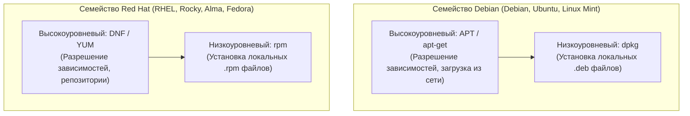

# Модуль 05: Управление пакетами, репозитории и сборка ПО из исходного кода

## 1. Экосистемы пакетов в Linux: DEB против RPM

В мире Linux доминируют две основные системы управления пакетами:



### Сравнение низкоуровневых утилит
| Задача | Debian / Ubuntu (`dpkg`) | RHEL / Rocky / Fedora (`rpm`) |
| :--- | :--- | :--- |
| Установить локальный пакет | `dpkg -i package.deb` | `rpm -ivh package.rpm` |
| Удалить пакет (сохранив конфиги) | `dpkg -r package` | `rpm -e package` |
| Полное удаление (purge) | `dpkg -P package` | — (в RPM удаляет конфиги, если не изменены) |
| Список всех установленных пакетов | `dpkg -l` | `rpm -qa` |
| Список файлов внутри пакета | `dpkg -L package` | `rpm -ql package` |
| Определить, какому пакету принадлежит файл | `dpkg -S /usr/bin/curl` | `rpm -qf /usr/bin/curl` |
| Просмотр информации о файле пакета | `dpkg-deb -I package.deb` | `rpm -qip package.rpm` |
| Проверка целостности пакета (хэши/права) | `dpkg -V package` | `rpm -Va` (проверка всей системы) |

---

## 2. Репозитории и проверка цифровых подписей (GPG)

Высокоуровневые менеджеры (`apt` и `dnf`) обеспечивают автоматическое скачивание пакетов и всех их транзитивных зависимостей из доверенных хранилищ (репозиториев).

### Структура репозиториев в Debian / Ubuntu
Конфигурация хранится в `/etc/apt/sources.list` и в каталоге `/etc/apt/sources.list.d/*.list` (или в современном deb822 формате `.sources`).

```text
# Пример строки репозитория:
deb [signed-by=/etc/apt/keyrings/nginx.gpg] http://nginx.org/packages/ubuntu jammy nginx
```
- `deb` — бинарные пакеты (`deb-src` — пакеты с исходным кодом).
- `[signed-by=...]` — путь к открытому GPG-ключу, которым подписан файл `Release` репозитория.
- URL сервера репозитория.
- Кодовое имя релиза ОС (`jammy`, `noble`, `bookworm`).
- Компоненты (`main`, `restricted`, `universe`, `multiverse`).

> ⚠️ **Безопасность (APT Keyrings)**: Устаревший метод `apt-key add` признан небезопасным (deprecated), так как добавлял ключ в глобальное доверенное хранилище `/etc/apt/trusted.gpg`, позволяя стороннему репозиторию подписывать любые системные пакеты. Современный стандарт — сохранять ключ в `/etc/apt/keyrings/<repo>.gpg` и явно указывать `signed-by` в строке репозитория.

### Структура репозиториев в RHEL / Rocky (`.repo`)
Конфигурация хранится в `/etc/yum.repos.d/*.repo`:
```ini
[nginx-stable]
name=nginx stable repo
baseurl=http://nginx.org/packages/centos/$releasever/$basearch/
gpgcheck=1
enabled=1
gpgkey=https://nginx.org/keys/nginx_signing.key
```
- `$releasever` и `$basearch` — переменные DNF (версия ОС и архитектура, например `9` и `x86_64`).
- `gpgcheck=1` — принудительная валидация криптографической подписи каждого RPM-пакета.

---

## 3. Сборка программного обеспечения из исходного кода (Source Build)

В продакшене сборка из исходников необходима, когда требуется:
- Включить кастомные флаги компилятора или экспериментальные модули (например, кастомный модуль в Nginx).
- Установить более новую версию утилиты, которой еще нет в официальном репозитории дистрибутива.
- Скомпилировать внутреннее проприетарное ПО компании.

### Стандартный конвейер сборки (GNU Autotools):
```mermaid
graph LR
    Source["Исходный код (.tar.gz)"] --> Configure["./configure --prefix=/opt/myapp"]
    Configure -->|Проверка компилятора и библиотек -> Makefile| Make["make -j$(nproc)"]
    Make -->|Бинарная компиляция (gcc/clang)| Install["sudo make install"]
    Install -->|Копирование в /opt/myapp| Binary["Готовая программа в /opt/myapp/bin"]
```

1. **`./configure`**: shell-скрипт, проверяющий наличие заголовочных файлов библиотек (`*-dev` или `*-devel`), версию компилятора (`gcc`, `clang`) и генерирующий `Makefile` под текущую систему.
   - Ключевой флаг: `--prefix=/opt/name` (предотвращает засорение стандартных системных директорий `/usr/bin` и `/usr/lib`).
2. **`make`**: утилита сборки, читающая `Makefile` и запускающая компилятор параллельно на всех ядрах (`-j$(nproc)`).
3. **`make install`**: копирует скомпилированные бинарные файлы, документацию и man-страницы в целевую директорию (`--prefix`).

---

## 4. Разделяемые динамические библиотеки (Shared Libraries)

Исполняемые файлы в Linux обычно линкуются динамически (Dynamically Linked) с системными библиотеками (`.so` — Shared Object):

- `ldd /path/to/binary` — показывает список всех динамических библиотек, от которых зависит программа, и пути их расположения в памяти.
- Ошибка: `error while loading shared libraries: libcustom.so: cannot open shared object file: No such file or directory`.

### Механизм поиска библиотек динамическим линкером (`ld.so`):
1. Пути, жестко зашитые в ELF-заголовок бинарника (`DT_RPATH` / `DT_RUNPATH`).
2. Переменная окружения `LD_LIBRARY_PATH` (временное переопределение для тестов).
3. Кэш системного линкера `/etc/ld.so.cache`.
4. Стандартные системные директории: `/lib64`, `/usr/lib64`, `/usr/lib`.

**Регистрация новой библиотеки в системе:**
1. Добавить путь к директории с библиотеками в `/etc/ld.so.conf.d/custom.conf` (например: `/opt/custom/lib`).
2. Выполнить команду обновления кэша линкера:
   ```bash
   sudo ldconfig
   ```
3. Проверить, появилась ли библиотека в системном кэше:
   ```bash
   ldconfig -p | grep libcustom
   ```


---

## 5. Безопасность цепочки поставок ПО и защита бинарных файлов (Binary Hardening)

### 1. Атаки на цепочки поставок (Supply Chain Attacks) через пакеты
Пакетные менеджеры Linux при установке пакета выполняют так называемые **Maintainer Scripts** с неограниченными правами root:
- `preinst` — выполняется ДО распаковки файлов.
- `postinst` — выполняется ПОСЛЕ распаковки (часто настраивает сервисы, генерирует ключи).
- `prerm` / `postrm` — скрипты удаления.

Если злоумышленник публикует вредоносный пакет (Typosquatting) или компрометирует сторонний репозиторий PPA/COPR, скрипт `postinst` может выполнить произвольный системный код в момент вызова `apt-get install` или `dnf install`, до того как администратор вообще успеет запустить программу!
**Защита**: Инспекция скриптов пакета без установки:
```bash
dpkg-deb -e package.deb /tmp/pkg_metadata
cat /tmp/pkg_metadata/postinst
```

### 2. Подмена разделяемых библиотек (Shared Object Hijacking)
1. **`LD_PRELOAD`**: Переменная окружения заставляет динамический линкер загружать указанную библиотеку ПЕРВОЙ, переопределяя стандартные функции C (`puts`, `fopen`, `getuid`).
2. **`/etc/ld.so.preload`**: Глобальный системный файл предзагрузки. Любая библиотека, записанная в этот файл, автоматически инжектируется во **ВСЕ** процессы в операционной системе (классический вектор закрепления руткитов User-space).
3. **Опасный `RPATH`**: Если бинарный файл скомпилирован с флагом `DT_RPATH = .` (текущая директория), запуск этой программы в каталоге, где злоумышленник создал вредоносный `libc.so.6`, приведет к выполнению произвольного кода.

### 3. Механизмы защиты бинарников от эксплуатации (Binary Protections)

| Защитный механизм | Флаг компилятора GCC | Принцип защиты |
| :--- | :--- | :--- |
| **Stack Canary** | `-fstack-protector-strong` | Случайное 64-битное значение на стеке перед адресом возврата (RIP). При переполнении буфера канарейка повреждается, ядро вызывает `__stack_chk_fail` и аварийно завершает процесс, предотвращая угон потока исполнения. |
| **NX / DEP** (No-Execute) | `-Wl,-z,noexecstack` | Сегменты памяти Стек и Куча помечаются флагом `Non-Executable`. Попытка исполнить шеллкод на стеке вызывает `SIGSEGV`. |
| **PIE** (Position Independent Executable) | `-fPIE -pie` | Код программы компилируется без жестких адресов, что позволяет ядру рандомизировать его адресное пространство в памяти (**ASLR**). |
| **Full RELRO** (Relocation Read-Only) | `-Wl,-z,relro,-z,now` | Таблица связывания функций (GOT — Global Offset Table) заполняется динамическим линкером при старте и сразу переводится в режим Read-Only. Атакующий не может перезаписать адреса функций в GOT. |
| **Fortify Source** | `-D_FORTIFY_SOURCE=2 -O2` | Замена небезопасных строковых функций (`strcpy`, `sprintf`) их защищенными аналогами с контролем границ буфера во время компиляции. |

```bash
# Проверка флагов защиты любого бинарного файла:
# (требуется утилита checksec из пакета checksec):
checksec --file=/usr/bin/curl
```
