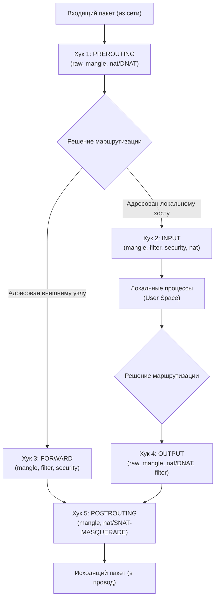

# Модуль 06: Сетевой стек, управление трафиком и межсетевые экраны в Linux

> **Цель модуля**: Сформировать фундаментальное понимание работы сетевого стека ядра Linux, архитектуры `Netfilter`, подсистем фильтрации трафика (`iptables`, `nftables`, `ufw`, `firewalld`), протокола SSH в контексте корпоративной безопасности (Hardening по CIS Benchmark), а также практических навыков глубокой сетевой диагностики с использованием `iproute2`, `ss` и `tcpdump`.

---

## Содержание
1. [Архитектура сетевой подсистемы ядра Linux](#1-архитектура-сетевой-подсистемы-ядра-linux)
2. [Современный инструментарий управления сетью: iproute2](#2-современный-инструментарий-управления-сетью-iproute2)
3. [Исследование и мониторинг сетевых сокетов: утилита ss](#3-исследование-и-мониторинг-сетевых-сокетов-утилита-ss)
4. [Подсистема разрешения доменных имен (DNS) в Linux](#4-подсистема-разрешения-доменных-имен-dns-в-linux)
5. [Безопасность удаленного доступа: SSH Hardening (CIS Benchmark)](#5-безопасность-удаленного-доступа-ssh-hardening-cis-benchmark)
6. [Архитектура пакетной фильтрации: Netfilter, iptables и nftables](#6-архитектура-пакетной-фильтрации-netfilter-iptables-и-nftables)
7. [Высокоуровневые фаерволы: UFW и Firewalld](#7-высокоуровневые-фаерволы-ufw-и-firewalld)
8. [Глубокий анализ пакетов и траблшутинг: tcpdump и сетевые утилиты](#8-глубокий-анализ-пакетов-и-траблшутинг-tcpdump-и-сетевые-утилиты)

---

## 1. Архитектура сетевой подсистемы ядра Linux

Сетевой стек Linux реализует эталонную модель TCP/IP непосредственно в пространстве ядра (*Kernel Space*). Передача данных между сетевой картой (NIC) и пользовательскими приложениями (*User Space*) спроектирована для обеспечения минимальных задержек и максимальной пропускной способности.

### 1.1. Жизненный цикл входящего пакета

Когда электрический или оптический сигнал поступает на сетевой интерфейс, он проходит многоуровневый путь:

1. **Прием пакета контроллером NIC**: Физический кадр Ethernet считывается в кольцевой буфер приема контроллера (*RX Ring Buffer*) с использованием прямого доступа к памяти (**DMA** — *Direct Memory Access*), минуя CPU.
2. **Аппаратное прерывание (Hard IRQ)**: Контроллер посылает сигнал CPU о наличии новых данных. Обработчик прерывания ядра отключает дальнейшие аппаратные прерывания для данного интерфейса и планирует программное прерывание.
3. **Подсистема NAPI (New API) и SoftIRQ**: Ядро инициирует софтовое прерывание `NET_RX_SOFTIRQ`. Функция драйвера в режиме опроса (*polling*) считывает пакеты из кольцевого буфера пачками (бюджет по умолчанию — 300 пакетов), что предотвращает явление *Interrupt Storm* при высоких нагрузках.
4. **Выделение структуры `sk_buff`**: Каждый пакет инкапсулируется в структуру ядра `struct sk_buff` (Socket Buffer). Этот дескриптор хранит указатели на заголовки сетевых уровней (L2, L3, L4) и полезную нагрузку без постоянного копирования памяти.
5. **Очереди дисциплины трафика (qdisc)**: Пакет передается подсистеме управления трафиком (*Traffic Control* / qdisc) для возможной классификации, шейпинга или фильтрации.
6. **Сетевой уровень (L3 — IPv4 / IPv6)**: Выполняется проверка контрольной суммы заголовка IP, обработка параметров IP. Пакет проходит через хуки подсистемы `Netfilter` (`PREROUTING`).
7. **Маршрутизация (FIB Lookup)**: Ядро просматривает базу данных маршрутизации (*Forwarding Information Base*). Определяется:
   - Предназначен ли пакет локальному хосту (*Local In*).
   - Требуется ли пересылка на другой интерфейс (*Forward*).
8. **Транспортный уровень (L4 — TCP / UDP / ICMP)**:
   - Если протокол **TCP**: пакет сопоставляется с таблицей хэшей сокетов (4-tuple: `src_ip`, `src_port`, `dst_ip`, `dst_port`), проверяются флаги (SYN, ACK, FIN), обновляется окно приема и отправляется подтверждение.
   - Если протокол **UDP**: пакет направляется напрямую в очередь сокета соответствующего порта.
9. **Буфер сокета и системный вызов**: Пакет помещается в буфер приема сокета (`sk_receive_queue`). Ожидающее приложение в User Space пробуждается (через `epoll`, `select` или блокирующий вызов) и копирует данные из памяти ядра в буфер приложения с помощью системного вызова `read()` или `recv()`.

```mermaid
flowchart TD
    subgraph Hardware ["1. Физический уровень (Hardware)"]
        NIC["Сетевой адаптер (NIC)"] -->|DMA| RXRing["RX Ring Buffer (RAM)"]
        NIC -->|Hard IRQ| CPU["CPU Core (IRQ Handler)"]
    end

    subgraph KernelSpace ["2. Пространство ядра (Kernel Space)"]
        CPU -->|Расписание| SoftIRQ["SoftIRQ: NET_RX_SOFTIRQ"]
        RXRing -->|NAPI Polling| SKB["Выделение struct sk_buff"]
        SoftIRQ --> SKB
        
        SKB --> L2["L2: Ethernet драйвер & Демультиплексирование"]
        L2 --> NetfilterPre["Netfilter: PREROUTING (conntrack, raw, mangle, nat)"]
        
        NetfilterPre --> Routing{"Решение маршрутизации (FIB Lookup)"}
        
        Routing -->|Пакет для другого узла| Forward["Netfilter: FORWARD"]
        Forward --> NetfilterPost["Netfilter: POSTROUTING"]
        NetfilterPost --> TX["TX qdisc -> NIC Ring -> Внешняя сеть"]
        
        Routing -->|Пакет для этого узла| LocalIn["Netfilter: INPUT"]
        LocalIn --> L4["L4: TCP / UDP стек"]
        L4 --> SockBuf["Socket RX Buffer (sk_receive_queue)"]
    end

    subgraph UserSpace ["3. Пространство пользователя (User Space)"]
        SockBuf -->|recv() / read() via epoll| App["Приложение (Nginx, SSHd, Python)"]
    end
```

---

## 2. Современный инструментарий управления сетью: iproute2

В современных дистрибутивах пакет `net-tools` (`ifconfig`, `route`, `netstat`, `arp`) признан **устаревшим (deprecated)** с 2009 года. Причина: `net-tools` взаимодействует с ядром через устаревший интерфейс `/proc/net` и устаревшие системные вызовы `ioctl`, не поддерживающие множественные IP-адреса, пространства имен сети (network namespaces), сложные таблицы маршрутизации и метрики policy routing.

Пакет **`iproute2`** взаимодействует с сетевой подсистемой ядра через высокопроизводительный сокет **Netlink** (`AF_NETLINK`), обеспечивая атомарные операции и полный контроль.

### Таблица соответствия команд устаревшего `net-tools` и современного `iproute2`

| Устаревшая команда (`net-tools`) | Современная команда (`iproute2`) | Описание операции |
| :--- | :--- | :--- |
| `ifconfig` | `ip link show` / `ip addr show` | Просмотр состояния интерфейсов и IP-адресов |
| `ifconfig eth0 up/down` | `ip link set dev eth0 up/down` | Включение / выключение сетевого интерфейса |
| `ifconfig eth0 192.168.1.10/24` | `ip addr add 192.168.1.10/24 dev eth0` | Назначение IP-адреса интерфейсу |
| `ifconfig eth0:1 10.0.0.1` (алиасы) | `ip addr add 10.0.0.1/24 dev eth0 label eth0:1` | Добавление дополнительного вторичного IP |
| `route -n` | `ip route show` | Просмотр таблицы маршрутизации ядра |
| `route add default gw 192.168.1.1` | `ip route add default via 192.168.1.1 dev eth0` | Добавление шлюза по умолчанию (default gateway) |
| `route add -net 10.10.0.0/16 gw 10.0.0.1` | `ip route add 10.10.0.0/16 via 10.0.0.1 dev eth0` | Добавление статического маршрута к подсети |
| `arp -an` | `ip neigh show` | Просмотр таблицы ARP-кэша (соседние узлы L2) |
| `arp -d 192.168.1.5` | `ip neigh del 192.168.1.5 dev eth0` | Удаление записи из таблицы ARP |
| `netstat -tulnp` | `ss -tulnp` | Анализ открытых портов и слушающих сокетов |

### Детальный разбор подкоманд `ip`:

#### 1. Управление канальным уровнем: `ip link`
```bash
# Вывести список интерфейсов с подробной L2-статистикой (RX/TX errors, dropped, carrier)
ip -s link show

# Изменить MTU (Maximum Transmission Unit) для поддержки Jumbo Frames
ip link set dev eth0 mtu 9000

# Изменить MAC-адрес интерфейса (требуется предварительно погасить интерфейс)
ip link set dev eth0 down
ip link set dev eth0 address 00:11:22:33:44:55
ip link set dev eth0 up

# Создание виртуальных интерфейсов (VLAN, Bridge, Veth)
ip link add name br0 type bridge
ip link add link eth0 name eth0.100 type vlan id 100
ip link add veth-host type veth peer name veth-container
```

#### 2. Управление сетевым уровнем (L3): `ip addr`
```bash
# Краткий вывод информации об адресах (только IPv4)
ip -4 -brief addr show

# Добавление второго IP-адреса на тот же физический интерфейс
ip addr add 192.168.10.50/24 dev eth0

# Удаление конкретного IP-адреса
ip addr del 192.168.10.50/24 dev eth0

# Очистка ВСЕХ назначенных адресов интерфейса (flush)
ip addr flush dev eth0
```

#### 3. Управление таблицами маршрутизации: `ip route`
Таблица маршрутизации в Linux выбирает наиболее специфичный маршрут (принцип *Longest Prefix Match* — наибольшая маска подсети).

```bash
# Просмотр таблицы маршрутизации
ip route show

# Добавление маршрута с указанием метрики (приоритета)
# Меньшее значение метрики означает более высокий приоритет
ip route add 172.16.0.0/16 via 192.168.1.254 dev eth0 metric 100

# Добавление черной дыры (blackhole) для немедленного сброса вредоносного трафика на уровне ядра
ip route add blackhole 203.0.113.0/24

# Проверка, какой именно маршрут и интерфейс ядро выберет для отправки пакета к конкретному IP
ip route get 8.8.8.8
# Вывод покажет: 8.8.8.8 via 192.168.1.1 dev eth0 src 192.168.1.15 uid 1000 cache
```

---

## 3. Исследование и мониторинг сетевых сокетов: утилита ss

Утилита **`ss` (Socket Statistics)** является частью `iproute2`. В отличие от `netstat`, который парсит гигантские текстовые файлы в `/proc/net/tcp` (что приводит к резкому падению производительности при наличии десятков тысяч открытых соединений), `ss` делает прямой системный вызов ядра `sock_diag` через Netlink, возвращая бинарную структуру данных мгновенно.

### Ключевые флаги утилиты `ss`

| Флаг | Полное имя | Назначение |
| :--- | :--- | :--- |
| `-t` | `--tcp` | Отображать только сокеты протокола TCP |
| `-u` | `--udp` | Отображать только сокеты протокола UDP |
| `-l` | `--listening` | Показать только слушающие сокеты (*LISTEN state*) |
| `-a` | `--all` | Показать как слушающие, так и установленные сокеты (*ESTABLISHED, TIME-WAIT и т.д.*) |
| `-n` | `--numeric` | Не разрешать имена сервисов и хостов (выводить сырые IP:порт) — **критично для скорости!** |
| `-p` | `--processes` | Показать PID и имя процесса, которому принадлежит сокет (требуются права `root` / `sudo`) |
| `-i` | `--info` | Вывести детальную TCP-статистику (RTT, CWND, MSS, retransmits, pacing rate) |
| `-e` | `--extended` | Отображать UID владельца сокета и индекс inode в ядре |
| `-s` | `--summary` | Сводная таблица статистики сокетов по протоколам |

### Практические примеры фильтрации с помощью `ss`

```bash
# 1. Золотой стандарт сисадмина: все слушающие TCP и UDP порты с указанием процессов
sudo ss -tulnp

# 2. Фильтрация по состоянию TCP: найти все соединения в состоянии TIME_WAIT или CLOSE_WAIT
ss -tan state time-wait
ss -tan state close-wait

# 3. Фильтрация по номерам портов (использование синтаксиса фильтров ss)
# Найти все активные соединения, где удаленный или локальный порт равен 80 или 443:
ss -tan '( dport = :http or dport = :https )'

# 4. Найти все исходящие подключения к определенной подсети:
ss -tan dst 10.50.0.0/16

# 5. Выявить сокеты с аномальной внутренней очередью (Send-Q / Recv-Q):
# В режиме LISTEN:
#   Recv-Q = текущее количество соединений в очереди accept() (backlog)
#   Send-Q = максимальный размер бэклога сокета
ss -lnt
```

---

## 4. Подсистема разрешения доменных имен (DNS) в Linux

Разрешение доменных имен в Linux состоит из нескольких взаимосвязанных слоев: системные библиотеки C (glibc), файлы статической конфигурации, диспетчер имен и локальные кэширующие резолверы.

```mermaid
flowchart LR
    App["Приложение (curl / ping / browser)"] -->|getaddrinfo()| LibC["glibc resolver"]
    LibC --> Conf["/etc/nsswitch.conf"]
    
    Conf -->|1. files| Hosts["/etc/hosts"]
    Conf -->|2. dns / resolve| Resolver["/etc/resolv.conf"]
    
    Resolver -->|Stub Resolver 127.0.0.53| SystemdResolved["systemd-resolved daemon"]
    SystemdResolved -->|DNS Cache / Upstream DNS| Upstream["Внешние DNS (8.8.8.8, 1.1.1.1)"]
```

### 4.1. Конфигурационные файлы
1. **`/etc/nsswitch.conf` (Name Service Switch)**: Определяет порядок опроса источников при поиске хостов:
   ```text
   hosts: files mdns4_minimal [NOTFOUND=return] resolve [!UNAVAIL=return] dns
   ```
   Здесь директива `files` указывает ядру сначала проверить `/etc/hosts`. Если совпадений нет, запрос передается демону `resolve` (`systemd-resolved`) или модулю `dns`.

2. **`/etc/hosts`**: Локальная статическая таблица сопоставления IP и хостнеймов. Имеет приоритет над внешними DNS.

3. **`/etc/resolv.conf`**: Классический файл конфигурации резолвера.
   - `nameserver 1.1.1.1` — адрес вышестоящего DNS-сервера.
   - `search example.com corp.local` — суффиксы для автодополнения коротких имен хостов.
   - `options timeout:2 attempts:3 rotate` — параметры таймаута и балансировки между DNS.

4. **`systemd-resolved` (современный стандарт в Ubuntu/Debian и RHEL/Fedora)**:
   - Создает локальный резолвер-заглушку на адресе `127.0.0.53:53`.
   - Символическая ссылка `/etc/resolv.conf -> /run/systemd/resolve/stub-resolv.conf`.
   - Управление осуществляется через утилиту `resolvectl`:
     ```bash
     # Просмотр текущего статуса DNS и серверов на интерфейсах
     resolvectl status

     # Сброс локального DNS-кэша
     resolvectl flush-caches

     # Принудительная проверка резолвинга через systemd
     resolvectl query example.com
     ```

### 4.2. Диагностика DNS: утилита `dig` (Domain Information Groper)

`dig` является главным инструментом инженера для дебага DNS. В отличие от `ping`, он выполняет прямые DNS-запросы без оглядки на `/etc/hosts` и системный кэш.

```bash
# 1. Базовый запрос записи типа A с лаконичным выводом
dig example.com +short

# 2. Запрос конкретного типа записи (MX, TXT, NS, CNAME, SOA, AAAA)
dig example.com MX
dig example.com TXT

# 3. Запрос к конкретному DNS-серверу минуя системные настройки
dig @8.8.8.8 example.com +noall +answer

# 4. Трассировка делегирования зоны от корневых серверов (Root Hints) до авторитетного:
# Незаменимая команда при расследовании проблем с делегированием домена!
dig example.com +trace

# 5. Обратный DNS-запрос (Reverse DNS Lookup — PTR-запись):
dig -x 93.184.216.34 +short
```

#### Анатомия ответа `dig`:
- **HEADER**: Флаги статуса (`NOERROR` — успех; `NXDOMAIN` — домен не существует; `SERVFAIL` — сбой вышестоящего сервера; `REFUSED` — сервер отклонил запрос).
- **QUESTION SECTION**: Исходный вопрос (какой домен и какой тип записи запрошен).
- **ANSWER SECTION**: Полученные записи с указанием TTL (Time To Live в секундах).
- **AUTHORITY SECTION**: NS-серверы, ответственные за зону.

---

## 5. Безопасность удаленного доступа: SSH Hardening (CIS Benchmark)

Протокол SSH (Secure Shell) — основной вектор управления Linux-серверами и главная цель атак методом полного перебора (*brute-force*), атак со словарем и эксплуатации уязвимостей переполнения буфера.

Конфигурационный файл демона: `/etc/ssh/sshd_config`.

### 5.1. Ключевые параметры CIS Benchmark для SSH Daemon

| Директива конфигурации | Рекомендуемое значение | Обоснование безопасности |
| :--- | :--- | :--- |
| `Port` | Нестандартный (напр. `2222` или `50022`) | Отсекает 99% автоматических интернет-ботов и снижает зашумленность системных логов |
| `Protocol` | `2` | Запрет использования уязвимой первой версии протокола SSHv1 |
| `PermitRootLogin` | `no` (или `prohibit-password`) | Запрещает прямой вход пользователя `root`. Администраторы должны входить под своими учетными записями и повышать привилегии через `sudo` (аудируемость!) |
| `PasswordAuthentication` | `no` | Полный запрет аутентификации по паролям. Доступ разрешен исключительно по криптографическим ключам |
| `PubkeyAuthentication` | `yes` | Включение аутентификации по публичным ключам |
| `PermitEmptyPasswords` | `no` | Блокировка входа учетным записям без установленного пароля |
| `X11Forwarding` | `no` | Отключение проброса графического интерфейса X11 для предотвращения перехвата сессий |
| `MaxAuthTries` | `3` (по дефолту 6) | Разрыв TCP-соединения после 3 неудачных попыток ввода учетных данных в рамках одной сессии |
| `LoginGraceTime` | `30` (по дефолту 120) | Время (в секундах) на прохождение аутентификации. Защищает от атак удержания открытых сокетов (Slowloris/DoS) |
| `ClientAliveInterval` | `300` | Отправка keep-alive пакета клиенту каждые 5 минут для обнаружения обрыва связи |
| `ClientAliveCountMax` | `2` | Отключение неактивного клиента после 2 неподтвержденных keep-alive сообщений (10 минут простоя) |
| `AllowUsers` / `AllowGroups` | `admin devops deployer` | Белый список пользователей или групп, которым разрешен вход на сервер |
| `Banner` | `/etc/issue.net` | Юридическое предупреждение о несанкционированном доступе |
| `KexAlgorithms` | `curve25519-sha256,...` | Ограничение алгоритмов обмена ключами только современными криптостойкими методами |
| `Ciphers` | `chacha20-poly1305@openssh.com,...` | Использование только современных симметричных шифров (AEAD) |
| `MACs` | `hmac-sha2-512-etm@openssh.com,...` | Использование режима Encrypt-then-MAC |

### 5.2. Генерация криптостойких ключей
Вместо устаревших и медленных ключей RSA (даже 2048/4096 бит) стандартом индустрии является алгоритм **Ed25519** на базе эллиптических кривых Эдвардса (Edwards-curve Digital Signature Algorithm).

```bash
# Генерация ключа Ed25519 с 100 раундами KDF (защита от перебора парольной фразы на GPU)
ssh-keygen -t ed25519 -a 100 -C "admin@production-cluster"

# Копирование публичного ключа на целевой сервер
ssh-copy-id -i ~/.ssh/id_ed25519.pub -p 2222 admin@192.168.1.100

# Проверка корректности синтаксиса sshd_config перед перезапуском службы
# ВАЖНО: никогда не перезапускайте sshd без предварительной проверки синтаксиса!
sudo sshd -t
```

---

## 6. Архитектура пакетной фильтрации: Netfilter, iptables и nftables

Подсистема **Netfilter** представляет собой набор перехватчиков (*hooks*) внутри сетевого стека ядра Linux. Когда сетевой пакет продвигается по стеку, он последовательно вызывает обработчики зарегистрированных таблиц и правил.

### 6.1. Пять базовых хуков Netfilter
1. **`PREROUTING`**: Срабатывает сразу после поступления пакета от сетевого драйвера, до принятия решения о маршрутизации. Здесь выполняется подмена адреса назначения (*Destination NAT / Port Forwarding*).
2. **`INPUT`**: Срабатывает, если таблица маршрутизации определила, что пакет адресован локальному процессу на этом хосте.
3. **`FORWARD`**: Срабатывает, если пакет адресован другому хосту, а текущий сервер выступает в роли маршрутизатора (требуется `net.ipv4.ip_forward=1`).
4. **`OUTPUT`**: Срабатывает для пакетов, сгенерированных локальными процессами сервера перед отправкой в сеть.
5. **`POSTROUTING`**: Срабатывает непосредственно перед передачей пакета физическому сетевому интерфейсу. Здесь выполняется подмена адреса источника (*Source NAT / Masquerade*).



### 6.2. Таблицы и их назначение
- **`raw`**: Отключение отслеживания соединений (*Connection Tracking / conntrack*) для высоконагруженных сервисов (`NOTRACK`).
- **`mangle`**: Модификация заголовков пакетов (изменение TTL, TOS, установка маркеров `MARK` для policy-based routing).
- **`nat`**: Трансляция сетевых адресов (SNAT, DNAT, MASQUERADE, REDIRECT).
- **`filter`**: Основная таблица для межсетевого экранирования (цепочки `INPUT`, `FORWARD`, `OUTPUT`).

### 6.3. Синтаксис и практика `iptables`

Правило в `iptables` состоит из критериев (*matches*) и действия (*target*):
- Действия: `ACCEPT` (пропустить), `DROP` (молча отбросить), `REJECT` (отклонить с отправкой ICMP unreachable), `LOG` (записать в dmesg/syslog).

#### Базовые команды управления:
```bash
# Вывести правила с номерами строк, счетчиками пакетов и байт
sudo iptables -L -v -n --line-numbers

# Очистить все правила (Flush)
sudo iptables -F
sudo iptables -t nat -F

# Установить политики по умолчанию (Default Policy — модель Белого Списка)
sudo iptables -P INPUT DROP
sudo iptables -P FORWARD DROP
sudo iptables -P OUTPUT ACCEPT

# Разрешить трафик локальной петли (Loopback — критично для работы локальных служб!)
sudo iptables -A INPUT -i lo -j ACCEPT

# Разрешить уже установленные и зависимые соединения (Stateful Filtering via conntrack)
# Это главное правило любого stateful-фаервола!
sudo iptables -A INPUT -m conntrack --ctstate ESTABLISHED,RELATED -j ACCEPT

# Сбросить невалидные пакеты
sudo iptables -A INPUT -m conntrack --ctstate INVALID -j DROP

# Разрешить входящий SSH (порт 2222) с конкретной подсети администраторов
sudo iptables -A INPUT -p tcp -s 192.168.10.0/24 --dport 2222 -j ACCEPT

# Ограничение частоты подключений к SSH (защита от брутфорса без сторонних утилит):
# Не более 4 новых соединений в минуту с одного IP
sudo iptables -A INPUT -p tcp --dport 2222 -m state --state NEW -m recent --set --name SSH_BURST
sudo iptables -A INPUT -p tcp --dport 2222 -m state --state NEW -m recent --update --seconds 60 --hitcount 4 --name SSH_BURST -j DROP

# Настройка NAT Masquerade (для раздачи интернета во внутреннюю сеть через eth0)
sudo iptables -t nat -A POSTROUTING -o eth0 -s 10.0.0.0/24 -j MASQUERADE

# Port Forwarding (DNAT): перенаправление входящих пакетов с внешнего порта 8080 на внутренний сервер
sudo iptables -t nat -A PREROUTING -p tcp -i eth0 --dport 8080 -j DNAT --to-destination 10.0.0.5:80
```

### 6.4. Современный преемник: `nftables`

`nftables` заменяет `iptables`, `ip6tables`, `arptables` и `ebtables` единым унифицированным фреймворком.
**Преимущества `nftables`:**
- Единый синтаксис для IPv4 и IPv6 (семейство `inet`).
- Пакетная виртуальная машина (байткод): правила компилируются и выполняются в ядре намного быстрее.
- Поддержка множеств (*sets*) и словарей (*maps*), позволяющая объединить десятки правил `iptables` в одну эффективную инструкцию `O(1)`.
- Атомарное обновление конфигурации (нет race conditions при перезагрузке правил).

```nft
# Пример конфигурационного файла /etc/nftables.conf
table inet filter {
    # Создаем именованный сет разрешенных TCP-портов
    set allowed_tcp_ports {
        type inet_service
        elements = { 80, 443, 2222 }
    }

    chain input {
        type filter hook input priority 0; policy drop;

        # Разрешаем трафик петли
        iif "lo" accept

        # Отслеживание соединений (conntrack)
        ct state established,related accept
        ct state invalid drop

        # Разрешаем входящий ICMP (ping) с лимитом
        ip protocol icmp icmp type echo-request limit rate 5/second accept

        # Разрешаем порты из множества за одну проверку!
        tcp dport @allowed_tcp_ports accept
    }

    chain forward {
        type filter hook forward priority 0; policy drop;
    }

    chain output {
        type filter hook output priority 0; policy accept;
    }
}
```

---

## 7. Высокоуровневые фаерволы: UFW и Firewalld

Для упрощения администрирования в дистрибутивах используются абстракции над подсистемой ядра.

### 7.1. UFW (Uncomplicated Firewall) — Стандарт Ubuntu / Debian
UFW ориентирован на простоту и управление одиночным хостом.

```bash
# Включение и отключение
sudo ufw enable
sudo ufw disable

# Базовая политика безопасности (запретить всё входящее, разрешить исходящее)
sudo ufw default deny incoming
sudo ufw default allow outgoing

# Разрешение портов и протоколов
sudo ufw allow 2222/tcp comment "SSH Custom Port"
sudo ufw allow 80/tcp
sudo ufw allow 443/tcp

# Ограничение по источнику (доступ к базе данных PostgreSQL только с бэкенда)
sudo ufw allow from 10.0.1.25 to any port 5432 proto tcp

# Защита от брутфорса (встроенный rate limiting: блокировка IP при 6+ попытках за 30 сек)
sudo ufw limit 2222/tcp

# Просмотр правил с номерами строк и удаление по номеру
sudo ufw status numbered
sudo ufw delete 3
```

### 7.2. Firewalld — Стандарт RHEL / Rocky Linux / CentOS
Firewalld использует концепцию **зон безопасности** (*Zones*). Каждый сетевой интерфейс привязывается к определенной зоне с заданным уровнем доверия.

- Популярные зоны: `drop`, `block`, `public` (по умолчанию), `dmz`, `internal`, `trusted`.

```bash
# Просмотр активных зон и привязанных интерфейсов
sudo firewall-cmd --get-active-zones

# Открытие сервиса или порта в зоне public (только в рантайме)
sudo firewall-cmd --zone=public --add-service=https

# Перманентное открытие (сохранение после перезагрузки)
sudo firewall-cmd --permanent --zone=public --add-port=2222/tcp
sudo firewall-cmd --permanent --zone=public --add-service=http

# Применение перманентных изменений (Reload без разрыва существующих соединений)
sudo firewall-cmd --reload

# Rich Rules (сложные правила с логированием и фильтрацией по IP):
# Разрешить SSH только с корпоративной подсети с журналированием инцидентов
sudo firewall-cmd --permanent --zone=public --add-rich-rule='rule family="ipv4" source address="192.168.100.0/24" service name="ssh" log prefix="[SSH-ACCESS] " level="notice" limit value="3/m" accept'
```

---

## 8. Глубокий анализ пакетов и траблшутинг: tcpdump и сетевые утилиты

Когда прикладные утилиты возвращают ошибку `Connection timed out` или `Connection refused`, единственным достоверным источником правды является сетевой сниффер.

### 8.1. `tcpdump` и фильтры BPF (Berkeley Packet Filter)

`tcpdump` перехватывает сырые кадры непосредственно из сетевого драйвера с помощью сокета `AF_PACKET` ядра Linux.

#### Ключи запуска:
- `-i eth0` — интерфейс для перехвата (`-i any` — все интерфейсы).
- `-n` — не преобразовывать IP-адреса в имена хостов (критично для предотвращения генерации паразитного DNS-трафика!).
- `-nn` — не преобразовывать ни адреса, ни номера портов в имена сервисов.
- `-v`, `-vv`, `-vvv` — уровень подробности декодирования заголовков (TTL, ID, флаги TCP).
- `-s0` (snaplen) — захватывать пакет целиком, а не первые 68 байт.
- `-w capture.pcap` — запись сырых пакетов в файл стандартного формата PCAP для анализа в Wireshark.
- `-r capture.pcap` — чтение и анализ ранее сохраненного дампа.
- `-X` / `-XX` — шестнадцатеричный (HEX) и ASCII вывод содержимого пакета (полезно для отладки HTTP/SMTP).

#### Примеры мощных фильтров BPF:
```bash
# 1. Захват трафика определенного хоста и порта
sudo tcpdump -nn -i eth0 host 192.168.1.50 and port 80

# 2. Исключение шума (например, исключить свой собственный SSH-сеанс, чтобы терминал не завис)
sudo tcpdump -nn -i eth0 not port 22

# 3. Фильтрация по флагам TCP (детекция сканирования портов или SYN-флуда):
# Захват только TCP SYN пакетов (начало трехэтапного рукопожатия)
sudo tcpdump -nn -i eth0 'tcp[tcpflags] & (tcp-syn) != 0 and tcp[tcpflags] & (tcp-ack) == 0'

# 4. Захват пакетов сброса соединения (TCP RST):
sudo tcpdump -nn -i eth0 'tcp[tcpflags] & (tcp-rst) != 0'

# 5. Перехват ICMP пакетов (ping, Time Exceeded, Destination Unreachable):
sudo tcpdump -nn -i eth0 icmp
```

### 8.2. Инструменты активного тестирования сети

```bash
# Проверка доступности удаленного TCP порта с таймаутом (замена telnet)
nc -z -v -w 3 192.168.1.100 443

# Тестирование Path MTU (поиск MTU без фрагментации с установленным битом DF - Don't Fragment)
ping -c 2 -M do -s 1472 8.8.8.8
# Примечание: 1472 байта ICMP payload + 8 байт ICMP header + 20 байт IP header = 1500 байт MTU

# Комплексная трассировка сети с анализом потерь пакетов на каждом хопе (MTR)
mtr --report --report-cycles 10 1.1.1.1
```

---

## 9. Резюме архитектурных паттернов траблшутинга
При расследовании сетевых проблем всегда следуйте модели снизу вверх (OSI Bottom-Up):
1. **L1/L2 (Канал)**: `ip link show` (интерфейс `UP`? есть ли `carrier`? растут ли `RX-errors`?).
2. **L3 (IP и маршрутизация)**: `ip addr show` (верный ли IP/маска?), `ip route show` (есть ли `default via`?), `ip route get <target>` (куда ядро шлет пакет?).
3. **L4 (Транспорт и Фаервол)**: `iptables -vnL` / `nft list ruleset` (не блокируется ли трафик?), `ss -tulnp` (слушает ли приложение порт?), `tcpdump -nn -i any port <port>` (долетает ли SYN? отвечает ли сервер SYN-ACK?).
4. **L7 (Приложения и DNS)**: `dig <domain>` (резолвится ли имя?), `curl -Iv` (какой код ответа и заголовки?).


---

## 10. Сетевые атаки, Pivot-туннелирование и скрытие сервисов (Network Pivoting & Stealth)

### 1. Архитектура SSH Pivoting и проброс туннелей
В процессе аудита безопасности или администрирования многосегментных сетей бастион-хост (DMZ) часто является единственной точкой входа во внутреннюю изолированную подсеть (`10.0.0.0/24`):


#### Виды SSH-туннелирования:
1. **Локальный проброс портов (Local Port Forwarding, `-L`)**:
   Перенаправляет порт локальной машины через SSH на целевой внутренний сервер:
   ```bash
   ssh -L 5432:10.0.5.10:5432 admin@bastion.example.com
   # Теперь локальное подключение к localhost:5432 прозрачно попадает в изолированную СУБД!
   ```
2. **Удаленный обратный проброс (Remote / Reverse Port Forwarding, `-R`)**:
   Позволяет серверу во внутренней сети открыть доступ к своим службам на внешнем сервере:
   ```bash
   ssh -R 8080:localhost:80 user@public-vps.com
   ```
3. **Динамический SOCKS5 прокси (`-D`) и Proxychains**:
   Превращает SSH-клиент в полноценный SOCKS-прокси:
   ```bash
   ssh -D 1080 -N -f admin@bastion.example.com
   ```
   Использование с `proxychains4` позволяет заворачивать трафик **любой** утилиты (`curl`, `nmap`, `psql`) в туннель:
   ```bash
   proxychains4 curl http://10.0.5.10/internal_api
   ```

### 2. Скрытие сервисов: Технология Port Knocking
Для защиты административного порта SSH от непрерывного сканирования ботнетами порт закрывается правилом `DROP`. Для открытия порта клиент должен отправить серию TCP/UDP пакетов ("постучаться") по строго определенной секретной последовательности портов (например: 7000 -> 8000 -> 9000).

После валидации последовательности ядро добавляет IP клиента во временный динамический список разрешенных адресов (`recent` модуль iptables) на 30 секунд.
