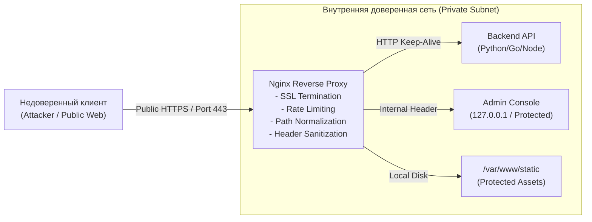
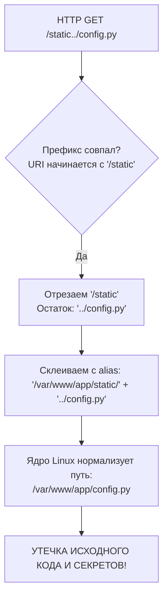
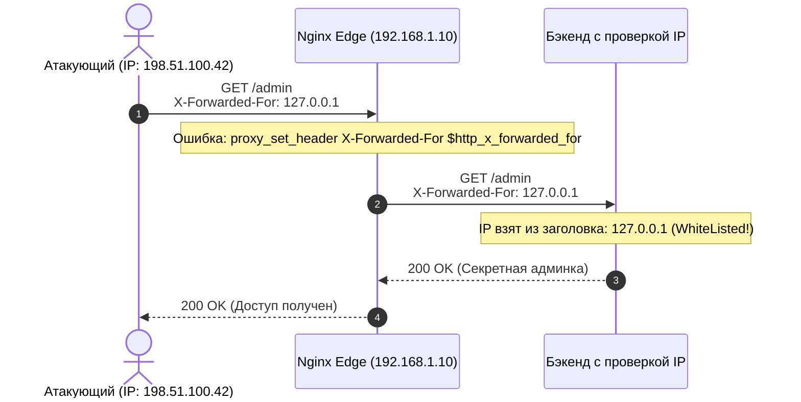
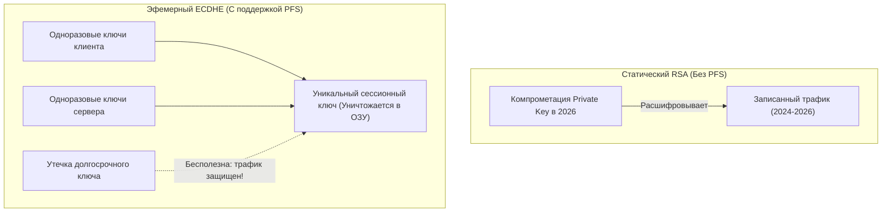
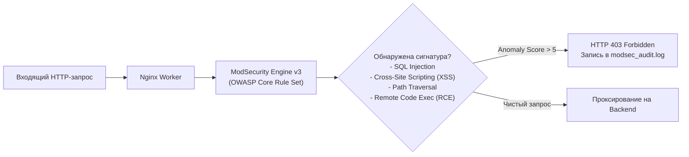

# 🛡️ Модуль 07: Web Infrastructure Exploitation, Nginx Misconfigurations & SSL Hardening

> **Цель модуля**: Сформировать комплексные инженерные знания по безопасности веб-серверов и обратных прокси на базе Nginx. Изучить векторы атак на архитектурные компоненты, методы обнаружения и эксплуатации критических мисконфигураций (Alias Traversal, SSRF через proxy_pass, спуфинг IP через X-Forwarded-For, Header Injection), освоить криптографический аудит SSL/TLS (уязвимости POODLE, Heartbleed, BEAST, PFS) и внедрить эшелонированную защиту веб-инфраструктуры (Rate Limiting от DoS, Security Headers, интеграция ModSecurity WAF).

---

## Содержание
1. [Архитектура Nginx в модели Zero-Trust и безопасности периметра](#1-архитектура-nginx-в-модели-zero-trust-и-безопасности-периметра)
2. [Опасные архитектурные мисконфигурации Nginx (Nginx Misconfigurations)](#2-опасные-архитектурные-мисконфигурации-nginx-nginx-misconfigurations)
   - [2.1. Alias Traversal (LFI / Path Traversal через отсутствие замыкающего слэша)](#21-alias-traversal-lfi--path-traversal-через-отсутствие-замыкающего-слэша)
   - [2.2. SSRF и проброс опасных заголовков через proxy_pass](#22-ssrf-и-проброс-опасных-заголовков-через-proxy_pass)
   - [2.3. Спуфинг IP-адресов через X-Forwarded-For и обход IP Whitelists](#23-спуфинг-ip-адресов-через-x-forwarded-for-и-обход-ip-whitelists)
   - [2.4. Header Injection, CRLF Injection и HTTP Request Smuggling](#24-header-injection-crlf-injection-и-http-request-smuggling)
3. [Анализ и эксплуатация криптографии SSL/TLS: От атак до Hardening](#3-анализ-и-эксплуатация-криптографии-ssltls-от-атак-до-hardening)
   - [3.1. Эволюция протокола: SSLv3, TLS 1.0–1.2 и TLS 1.3](#31-эволюция-протокола-sslv3-tls-1012-и-tls-13)
   - [3.2. Классические и современные атаки (POODLE, BEAST, Heartbleed, Sweet32)](#32-классические-и-современные-атаки-poodle-beast-heartbleed-sweet32)
   - [3.3. Принцип Perfect Forward Secrecy (PFS) и выбор шифронаборов](#33-принцип-perfect-forward-secrecy-pfs-и-выбор-шифронаборов)
   - [3.4. Промышленный Hardening: HSTS, OCSP Stapling, сессионные билеты](#34-промышленный-hardening-hsts-ocsp-stapling-сессионные-билеты)
4. [Эшелонированная защита веб-периметра (Infrastructure Defenses)](#4-эшелонированная-защита-веб-периметра-infrastructure-defenses)
   - [4.1. Двухзонный Rate Limiting против DoS и Brute-Force](#41-двухзонный-rate-limiting-против-dos-и-brute-force)
   - [4.2. Комплекс защитных заголовков (Security Headers: CSP, HSTS, X-Frame-Options)](#42-комплекс-защитных-заголовков-security-headers-csp-hsts-x-frame-options)
   - [4.3. Интеграция ModSecurity Web Application Firewall (WAF)](#43-интеграция-modsecurity-web-application-firewall-waf)
5. [Инструменты аудита и верификации безопасности веб-сервера](#5-инструменты-аудита-и-верификации-безопасности-веб-сервера)

---

## 1. Архитектура Nginx в модели Zero-Trust и безопасности периметра

Высокопроизводительный обратный прокси **Nginx** занимает критическое положение в архитектуре современных веб-приложений. Находясь на границе сети (DMZ / Edge), Nginx принимает необработанный трафик из недоверенной глобальной сети Internet и перенаправляет его во внутреннюю доверенную сеть к микросервисам (Upstreams).



### 1.1. Границы доверия (Trust Boundaries)
При проектировании инфраструктуры системный инженер обязан строго разделять три уровня доверия:
1. **Недоверенный контекст (Untrusted External Context)**: Любые входящие HTTP-заголовки, параметры URI, куки и тело запроса могут быть намеренно сфальсифицированы атакующим.
2. **Точка нормализации и демаркации (Nginx)**: Веб-сервер обязан валидировать формат запроса, нормализовать пути (`/static/../`), отрезать опасные заголовки и преобразовывать внешние идентификаторы в защищенные внутренние метаданные.
3. **Контекст приложений (Upstream / Backend)**: Бэкенды часто полагаются на предположение, что проверка подлинности и сетевая фильтрация уже выполнены прокси-сервером. Любая брешь в правилах нормализации или трансляции заголовков на Nginx приводит к компрометации нижележащих сервисов.

### 1.2. Модель процессов и изоляция
Nginx использует архитектуру с разделением привилегий:
- **Master Process (UID: root)**: Инициализирует сокеты на портах `< 1024` (80, 443), считывает приватные ключи SSL/TLS (`/etc/ssl/private/`) и порождает рабочие процессы. Не обрабатывает сетевые пакеты клиентов напрямую.
- **Worker Processes (UID: `www-data` / `nginx`)**: Работают с минимальными правами в непривилегированном контексте. Обрабатывают соединения через системный вызов `epoll`. В случае компрометации воркера через уязвимость переполнения буфера атакующий получает права непривилегированного пользователя, не имеющего прямого доступа к закрытым ключам Master-процесса в памяти.

---

## 2. Опасные архитектурные мисконфигурации Nginx (Nginx Misconfigurations)

Большинство успешных атак на обратные прокси Nginx вызваны не уязвимостями в исходном коде самого сервера (CVE), а ошибками конфигурирования (*misconfigurations*), допущенными системными администраторами и DevOps-инженерами.

### 2.1. Alias Traversal (LFI / Path Traversal через отсутствие замыкающего слэша)

Уязвимость **Alias Traversal** (также известная как *Off-by-slash*) возникает из-за тонкости сопоставления префиксов директивой `location` при использовании директивы `alias`.

#### Механизм возникновения уязвимости
Рассмотрим фрагмент конфигурации:

```nginx
# ОШИБКА: Отсутствует замыкающий слэш в location!
location /static {
    alias /var/www/app/static/;
}
```

Директива `alias` заменяет сопоставленную часть URI на указанную файловую директорию.
Когда клиент отправляет запрос:
```http
GET /static../config.py HTTP/1.1
Host: target.lab.local
```

1. Nginx проверяет сопоставление префикса: строка `/static../config.py` начинается с `/static`.
2. Nginx отрезает префикс `/static` от URI. Остается суффикс: `../config.py`.
3. Nginx подставляет этот суффикс к пути, заданному в директиве `alias`:
   $$\text{Путь на диске} = \text{/var/www/app/static/} + \text{../config.py}$$
4. Ядро ОС нормализует относительный путь `/var/www/app/static/../config.py` в абсолютный:
   $$\text{Результат} = \mathbf{/var/www/app/config.py}$$



#### Последствия эксплуатации
Атакующий получает возможность выйти за пределы каталога публичной статики и прочитать любые файлы в родительском каталоге веб-приложения:
- Исходный код бэкенда (`backend.py`, `app.js`, `settings.py`);
- Файлы окружения с паролями и токенами (`.env`, `.git/config`, `docker-compose.yml`);
- Конфигурации баз данных и секретные ключи сессий (`SECRET_KEY`).

#### Отличие `root` от `alias`
- **`root`**: Добавляет *полный* URI запроса к указанному пути. Запрос `GET /static/app.css` при `root /var/www;` ищет файл `/var/www/static/app.css`. При использовании `root` уязвимость Alias Traversal не возникает, так как слэш вставляется корректно.
- **`alias`**: *Заменяет* префикс `location` на указанный путь. Если в `location` нет слэша, склейка строк происходит без разделяющего разделителя каталогов `/`.

#### Устранение уязвимости (Remediation)
Всегда синхронизируйте наличие замыкающего слэша в директивах `location` и `alias`:

```nginx
# БЕЗОПАСНАЯ КОНФИГУРАЦИЯ:
location /static/ {
    alias /var/www/app/static/;
}
```
*Теперь запрос `/static../` не совпадет с префиксом `/static/` и сервер немедленно вернет 404 Not Found.*

---

### 2.2. SSRF и проброс опасных заголовков через `proxy_pass`

Server-Side Request Forgery (SSRF) на уровне Nginx возникает при динамическом формировании адреса назначения проксирования на основе пользовательского ввода или заголовков.

#### Опасные паттерны динамического `proxy_pass`:
```nginx
# ОШИБКА 1: Проксирование на хост из переменной $host или $http_host
location /proxy/ {
    proxy_pass http://$http_host/;
}

# ОШИБКА 2: Маршрутизация по GET-параметру
location /fetch {
    proxy_pass $arg_url;
}
```
В сценарии с `$http_host` атакующий передает заголовок:
```http
GET /proxy/ HTTP/1.1
Host: 169.254.169.254
```
Nginx выполняет HTTP-запрос к Cloud Metadata Service (AWS/GCP/OpenStack) по адресу `http://169.254.169.254/latest/meta-data/iam/security-credentials/`, передавая учетные данные инстанса злоумышленнику.

#### Утечка внутренних заголовков (Internal Header Injection)
Если во внутренней сети микросервисы используют специальные заголовки для авторизации (например, `X-Auth-User: admin` или `X-Internal-Secret: 9fa12b`), Nginx должен безусловно удалять или жестко перезаписывать их из входящего клиентского запроса:
```nginx
# Защита от подделки внутренних заголовков клиентом:
proxy_set_header X-Auth-User "";
proxy_set_header X-Internal-Caller "Nginx-Edge";
```

#### Защита внутренних блоков через директиву `internal`
Служебные `location`, предназначенные только для внутренних редиректов (например, через `X-Accel-Redirect` или страницы ошибок), обязаны содержать директиву `internal;`. Без нее любой внешний клиент может напрямую запросить служебный эндпоинт:
```nginx
location /internal-admin/ {
    internal; # Запрещает прямой доступ извне, возвращая 404
    proxy_pass http://10.0.0.5/;
}
```

---

### 2.3. Спуфинг IP-адресов через `X-Forwarded-For` и обход IP Whitelists

Многие бэкенд-приложения и административные панели ограничивают доступ по IP-адресу клиента (например, доступ разрешен только из офисной подсети `192.168.1.0/24` или с `127.0.0.1`). Поскольку Nginx выступает посредником, сокет TCP-соединения между Nginx и бэкендом всегда имеет IP-адрес самого Nginx. Для передачи реального адреса клиента используются HTTP-заголовки.

#### Механизм уязвимости
Если в конфигурации Nginx используется ошибочный проброс клиентского заголовка:

```nginx
# КРИТИЧЕСКАЯ УЯЗВИМОСТЬ: Доверие непроверенному заголовку клиента!
location /admin {
    proxy_set_header X-Forwarded-For $http_x_forwarded_for;
    proxy_pass http://backend_upstream;
}
```

Переменная `$http_x_forwarded_for` содержит **строго то значение**, которое передал сам клиент в HTTP-запросе!
Атакующий отправляет запрос:
```http
GET /admin HTTP/1.1
Host: portal.lab.local
X-Forwarded-For: 127.0.0.1
```
Бэкенд считывает заголовок `X-Forwarded-For`, видит адрес `127.0.0.1`, считает, что запрос пришел локально от доверенного администратора, и полностью открывает доступ к административной панели (*Authentication & Authorization Bypass*).



#### Правильная архитектура трансляции IP:
1. Использование системной переменной `$proxy_add_x_forwarded_for`:
   - Если заголовок `X-Forwarded-For` уже присутствовал в запросе клиента, Nginx берет его и дописывает адрес реального сокета клиента `$remote_addr` через запятую.
   - Пример: клиент передал `127.0.0.1`, сокет пришел с `198.51.100.42`. Переменная станет равна: `127.0.0.1, 198.51.100.42`.
2. Жесткая фиксация заголовка `X-Real-IP`:
   ```nginx
   proxy_set_header X-Real-IP $remote_addr;
   ```
3. Модуль **`ngx_http_realip_module`**:
   Если Nginx находится за CDN (Cloudflare) или аппаратным балансировщиком нагрузки (HAProxy, AWS ALB), используйте директивы модуля `real_ip`:
   ```nginx
   # Доверяем ТОЛЬКО проверенным upstream прокси
   set_real_ip_from 10.0.0.0/8;
   set_real_ip_from 172.16.0.0/12;
   real_ip_header X-Forwarded-For;
   real_ip_recursive on; # Раскручивает цепочку справа налево до первого недоверенного IP
   ```

---

### 2.4. Header Injection, CRLF Injection и HTTP Request Smuggling

#### CRLF Injection (Carriage Return Line Feed)
Символы `\r` (`%0d`) и `\n` (`%0a`) являются разделителями заголовков в спецификации HTTP/1.1.
Если Nginx выполняет перенаправление на основе пользовательского ввода без валидации:
```nginx
location /redirect {
    return 302 https://$host$request_uri;
}
```
Атакующий отправляет запрос:
```text
GET /redirect/%0d%0aSet-Cookie:%20session=hacked_session%0d%0a%0d%0a<h1>Defaced</h1> HTTP/1.1
```
Если сервер не санитизирует входную строку, браузер жертвы воспримет внедренный `\r\n\r\n` как конец блока заголовков и начало тела ответа. Это позволяет злоумышленнику осуществлять **HTTP Response Splitting**, фиксацию сессий (Session Fixation) и XSS.

#### HTTP Request Smuggling (Desync-атаки)
Возникает из-за разницы в интерпретации заголовков `Content-Length` (CL) и `Transfer-Encoding: chunked` (TE) между обратным прокси (Nginx) и бэкенд-сервером (Gunicorn, Apache, Tomcat).
- **CL.TE**: Nginx обрабатывает заголовок `Content-Length`, а бэкенд отдает приоритет `Transfer-Encoding`.
- **TE.CL**: Nginx обрабатывает `Transfer-Encoding`, а бэкенд читает `Content-Length`.

Атакующий может внедрить скрытый «контрабандный» запрос внутрь тела первого запроса, который затем будет приклеен к запросу следующего легитимного пользователя, позволяя перехватывать учетные данные или обходить правила безопасности Nginx.

---

## 3. Анализ и эксплуатация криптографии SSL/TLS: От атак до Hardening

Протокол TLS (Transport Layer Security) обеспечивает три базовых свойства безопасности:
1. **Конфиденциальность (Confidentiality)** — симметричное шифрование защищает данные от прослушивания.
2. **Целостность (Integrity)** — криптографические имитовставки (HMAC / AEAD) предотвращают модификацию трафика.
3. **Аутентификация (Authentication)** — сертификаты X.509 на основе асимметричной криптографии подтверждают подлинность сервера.

### 3.1. Эволюция протокола: SSLv3, TLS 1.0–1.2 и TLS 1.3

| Версия протокола | Год | Статус безопасности | Ключевые архитектурные дефекты / Особенности |
| :--- | :--- | :--- | :--- |
| **SSL 2.0 / 3.0** | 1995 / 1996 | ❌ **КРИТИЧЕСКИ ОПАСНЫ** | Уязвимы к POODLE, отсутствие защиты рукопожатия, слабый MAC |
| **TLS 1.0 / 1.1** | 1999 / 2006 | ❌ **УСТАРЕЛИ (Deprecated)** | Уязвимы к BEAST, CBC-режимы без Encrypt-then-MAC, слабые хэши MD5/SHA-1 |
| **TLS 1.2** | 2008 | ⚠️ **ТРЕБУЕТ ХАРДЕНИНГА** | Надежен только при использовании AEAD-шифров (GCM) и отключении устаревших алгоритмов |
| **TLS 1.3 (RFC 8446)** | 2018 | ✅ **СОВРЕМЕННЫЙ СТАНДАРТ** | 1-RTT Handshake, полное удаление RSA-key exchange, CBC, RC4, 3DES. Обязательный PFS |

### 3.2. Классические и современные атаки (POODLE, BEAST, Heartbleed, Sweet32)

#### 1. POODLE (Padding Oracle On Downgraded Legacy Encryption — CVE-2014-3566)
- **Цель**: Протокол SSL 3.0 и режимы блочного шифрования CBC.
- **Суть атаки**: В SSL 3.0 структура дополнения (padding) для режима CBC строго не определена и не покрыта проверкой целостности MAC. Атакующий, находящийся в позиции Man-in-the-Middle (MitM), принудительно заставляет браузер понизить версию протокола до SSL 3.0 (*Downgrade Dance*), модифицирует последний байт зашифрованного блока и отправляет его серверу. Анализируя реакцию сервера (принят запрос или возвращена ошибка padding oracle), атакующий расшифровывает защищенные куки сессии по 1 байту за каждые 256 запросов.

#### 2. BEAST (Browser Exploit Against SSL/TLS — CVE-2011-3389)
- **Цель**: Режим CBC в TLS 1.0.
- **Суть атаки**: В TLS 1.0 вектор инициализации (IV) для следующего блока шифрования предсказуем — он равен последнему зашифрованному блоку предыдущего пакета (*Chained IV*). Это позволяет реализовать атаку на основе подобранного открытого текста (Chosen-Plaintext Attack) и восстановить заголовки авторизации.

#### 3. Heartbleed (CVE-2014-0160)
- **Цель**: Библиотека OpenSSL (версии 1.0.1 – 1.0.1f) с включенным расширением TLS Heartbeat.
- **Суть атаки**: Отсутствие проверки границ длины пакета (*Missing Bounds Check*). Клиент отправляет Heartbeat-запрос с полезной нагрузкой 1 байт, но указывает в заголовке длину `65535` байт. Сервер без проверки выделяет и копирует из памяти процесса 64 КБ данных обратно клиенту, раскрывая закрытые ключи сервера, пароли и пользовательские сессии из кучи процесса Nginx.

#### 4. Sweet32 (CVE-2016-2183)
- **Цель**: Шифры с размером блока 64 бита (3DES, Blowfish).
- **Суть атаки**: Из-за парадокса дней рождения в режиме CBC после передачи $2^{32}$ блоков (около 32 ГБ трафика в рамках одной TLS-сессии) неизбежно происходит коллизия блоков шифротекста, что позволяет восстановить открытый текст. Все 64-битные шифры признаны устаревшими и запрещены к использованию.

---

### 3.3. Принцип Perfect Forward Secrecy (PFS) и выбор шифронаборов

В классическом TLS на основе RSA сервер использовал свой постоянный закрытый ключ для обмена ключом сессии:
$$\text{Клиент генерирует Pre-Master Secret} \longrightarrow \text{Шифрует RSA-ключом сервера} \longrightarrow \text{Сервер расшифровывает своим Private Key}$$

> **Критический риск статического RSA**: Если злоумышленник непрерывно записывает зашифрованный трафик компании на диск, а через 2 года скомпрометирует закрытый ключ сервера, он сможет **задним числом расшифровать весь терабайтный архив перехваченного трафика за все прошлые годы**.

#### Решение: Алгоритм Диффи-Хеллмана на эллиптических кривых (ECDHE)
При использовании **Ephemeral Diffie-Hellman (ECDHE)** для каждой новой сессии генерируется уникальная одноразовая пара ключей. Закрытые ключи сессии уничтожаются в оперативной памяти сразу после завершения сессии. Даже если долгосрочный закрытый ключ сервера будет похищен, расшифровать ранее записанные сессии математически невозможно (**Perfect Forward Secrecy — совершенная прямая секретность**).



#### Рекомендуемый Cipher Suite для TLS 1.2:
```nginx
ssl_ciphers 'ECDHE-ECDSA-AES128-GCM-SHA256:ECDHE-RSA-AES128-GCM-SHA256:ECDHE-ECDSA-AES256-GCM-SHA384:ECDHE-RSA-AES256-GCM-SHA384:ECDHE-ECDSA-CHACHA20-POLY1305:ECDHE-RSA-CHACHA20-POLY1305';
ssl_prefer_server_ciphers on;
```
*В протоколе TLS 1.3 шифронаборы зафиксированы на уровне стандарта (TLS_AES_256_GCM_SHA384, TLS_CHACHA20_POLY1305_SHA256, TLS_AES_128_GCM_SHA256) и не требуют ручного конфигурирования директивой `ssl_ciphers`.*

---

### 3.4. Промышленный Hardening: HSTS, OCSP Stapling, сессионные билеты

#### 1. HTTP Strict Transport Security (HSTS — RFC 6797)
HSTS инструктирует браузер принудительно открывать сайт исключительно по защищенному протоколу HTTPS, полностью блокируя попытки перехода по HTTP и предотвращая атаки класса **SSL Stripping** (например, через `sslstrip`).

```nginx
# Включение HSTS на 1 год с поддоменами и правом включения в preloaded-список браузеров:
add_header Strict-Transport-Security "max-age=31536000; includeSubDomains; preload" always;
```

#### 2. OCSP Stapling (Прошивка статуса сертификата — RFC 6066)
При обычном TLS-соединении браузер клиента вынужден отправлять отдельный HTTP-запрос к OCSP-серверу удостоверяющего центра (CA) для проверки, не был ли сертификат отозван. Это замедляет соединение и раскрывает историю посещений пользователя центру сертификации (нарушение приватности).
При **OCSP Stapling** Nginx сам периодически опрашивает OCSP-сервер CA, кэширует подписанный ответ и прикрепляет («пришпиливает») его к TLS Handshake клиенту:

```nginx
ssl_stapling on;
ssl_stapling_verify on;
ssl_trusted_certificate /etc/nginx/ssl/ca-bundle.crt;
resolver 1.1.1.1 8.8.8.8 valid=300s;
resolver_timeout 5s;
```

#### 3. Сессионные билеты (Session Tickets)
Сессионные тикеты позволяют возобновлять TLS-сессию без полного рукопожатия. Однако, если статический ключ шифрования тикетов (`ssl_session_ticket_key`) не ротируется регулярно, компрометация этого ключа нарушает свойства Perfect Forward Secrecy. В средах с высокими требованиями к безопасности билеты отключают, оставляя кэширование сессий на стороне сервера:
```nginx
ssl_session_tickets off;
ssl_session_cache shared:SSL:20m;
ssl_session_timeout 1d;
```

---

## 4. Эшелонированная защита веб-периметра (Infrastructure Defenses)

### 4.1. Двухзонный Rate Limiting против DoS и Brute-Force

Для защиты приложений от перегрузок и атак перебора паролей Nginx реализует алгоритм **Leaky Bucket** («дырявое ведро»). Промышленный подход требует использования **двухзонного ограничения**:
1. **Зона частоты запросов (`limit_req_zone`)**: Ограничивает количество HTTP-запросов в единицу времени.
2. **Зона одновременных соединений (`limit_conn_zone`)**: Ограничивает количество параллельно открытых TCP-сокетов с одного IP.

```nginx
http {
    # 1. Хранение IP в бинарном формате: $binary_remote_addr занимает всего 4 байта (IPv4)
    # Зона на 10 МБ способна хранить состояние ~160 000 уникальных IP одновременно
    limit_req_zone $binary_remote_addr zone=api_req_limit:10m rate=10r/s;
    limit_req_zone $binary_remote_addr zone=login_brute_limit:10m rate=1r/s;
    limit_conn_zone $binary_remote_addr zone=conn_limit_per_ip:10m;

    # Возврат статуса 429 Too Many Requests вместо дефолтного 503 Service Unavailable
    limit_req_status 429;
    limit_conn_status 429;

    server {
        # Глобальное ограничение параллельных TCP-сокетов с одного IP: максимум 20
        limit_conn conn_limit_per_ip 20;

        # Публичный API: допускаем всплеск до 20 запросов без искусственной задержки
        location /api/ {
            limit_req zone=api_req_limit burst=20 nodelay;
            proxy_pass http://backend_cluster;
        }

        # Критический эндпоинт входа: жесткий лимит 1 запрос в сек, всплеск до 3
        location /api/v1/auth/login {
            limit_req zone=login_brute_limit burst=3 nodelay;
            proxy_pass http://backend_cluster;
        }
    }
}
```

- **`burst`**: Размер буфера всплеска. Позволяет клиенту кратковременно превысить лимит (например, при загрузке страницы с пачкой скриптов).
- **`nodelay`**: Без этого флага запросы из буфера `burst` искусственно задерживаются таймером для выравнивания скорости. С флагом `nodelay` запросы обрабатываются мгновенно, а все, что превышает `rate + burst`, немедленно отсекается с кодом 429.

---

### 4.2. Комплекс защитных заголовков (Security Headers: CSP, HSTS, X-Frame-Options)

HTTP-заголовки безопасности передают браузеру клиента строгие инструкции по ограничению небезопасного поведения.

```nginx
# 1. Content Security Policy (CSP): Запрещает выполнение инлайновых скриптов и недоверенных источников
add_header Content-Security-Policy "default-src 'self'; script-src 'self'; img-src 'self' data:; style-src 'self' 'unsafe-inline'; frame-ancestors 'self';" always;

# 2. X-Frame-Options: Защита от кликджекинга (Clickjacking / UI Redressing)
add_header X-Frame-Options "SAMEORIGIN" always;

# 3. X-Content-Type-Options: Запрещает браузеру MIME-sniffing (подмену объявленного Content-Type)
add_header X-Content-Type-Options "nosniff" always;

# 4. Referrer-Policy: Ограничивает передачу конфиденциальных путей и токенов в заголовке Referer
add_header Referrer-Policy "strict-origin-when-cross-origin" always;

# 5. Permissions-Policy: Отключает опасные браузерные API (микрофон, камера, геолокация)
add_header Permissions-Policy "geolocation=(), camera=(), microphone=(), payment=()" always;

# 6. Отключение отображения версии Nginx в заголовке Server и на страницах ошибок
server_tokens off;
```
> **Внимание**: Всегда добавляйте ключевое слово **`always`** в директиву `add_header`. Без него Nginx не будет добавлять защитные заголовки к ответам с кодами ошибок (4xx, 5xx), оставляя страницы авторизации или ошибок уязвимыми к атакам.

---

### 4.3. Интеграция ModSecurity Web Application Firewall (WAF)

**ModSecurity** — промышленный межсетевой экран прикладного уровня с открытым исходным кодом (WAF). В современных системах используется версия **libmodsecurity v3** со специальным коннектором для Nginx.



#### Настройка интеграции:
```nginx
# Подключение динамического модуля в начале nginx.conf
load_module modules/ngx_http_modsecurity_module.so;

http {
    server {
        listen 443 ssl;
        server_name secure.company.com;

        modsecurity on;
        modsecurity_rules_file /etc/nginx/modsec/main.conf;

        location / {
            proxy_pass http://internal_backend;
        }
    }
}
```

Файл `/etc/nginx/modsec/main.conf`:
```apache
# Базовый конфиг ModSecurity
SecRuleEngine On
SecRequestBodyAccess On
SecResponseBodyAccess Off
SecAuditEngine RelevantOnly
SecAuditLog /var/log/nginx/modsec_audit.log

# Подключение OWASP Core Rule Set (CRS)
Include /etc/nginx/modsec/coreruleset/crs-setup.conf
Include /etc/nginx/modsec/coreruleset/rules/*.conf
```

---

## 5. Инструменты аудита и верификации безопасности веб-сервера

### 5.1. Аудит конфигурации SSL/TLS
1. **Проверка поддерживаемых протоколов через OpenSSL**:
   ```bash
   # Проверка, отключен ли уязвимый протокол TLS 1.0 (должно завершиться ошибкой рукопожатия):
   openssl s_client -connect 127.0.0.1:443 -tls1
   
   # Проверка работы современного TLS 1.3:
   openssl s_client -connect 127.0.0.1:443 -tls1_3
   ```
2. **Комплексный аудит шифров утилитой `nmap`**:
   ```bash
   nmap --script ssl-enum-ciphers -p 443 127.0.0.1
   ```
3. **Утилита `testssl.sh`**:
   Эталонный консольный инструмент тестирования шифрования на соответствие мировым стандартам безопасности:
   ```bash
   testssl.sh --severity HIGH https://target.lab.local
   ```

### 5.2. Аудит заголовков и мисконфигураций через `curl`
```bash
# Проверка наличия Security Headers:
curl -s -I https://portal.lab.local | grep -Ei 'strict-transport|x-frame|content-security|x-content-type'

# Проверка на уязвимость Alias Traversal:
curl -s -i "http://127.0.0.1:8080/static../config.py"

# Проверка спуфинга X-Forwarded-For:
curl -s -i -H "X-Forwarded-For: 127.0.0.1" http://127.0.0.1:8080/admin
```

---

## 💡 Резюме архитектурных правил безопасности Nginx
1. Никогда не объявляйте `alias` без завершающего слэша, если в префиксе `location` также есть путь.
2. Никогда не передавайте нефильтрованный клиентский заголовок `$http_x_forwarded_for` в апстрим.
3. Полностью отключайте устаревшие протоколы SSLv3, TLS 1.0, TLS 1.1 и шифры без Perfect Forward Secrecy.
4. Защищайте критические эндпоинты авторизации и API двухзонным Rate Limiting со статусом 429.
5. Применяйте полный стек HTTP Security Headers с обязательным флагом `always`.
