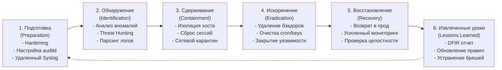
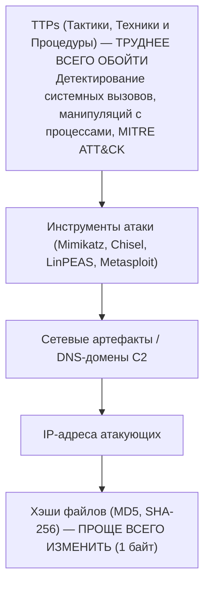
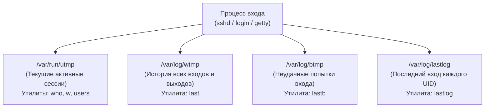

# 🔍 Модуль 08: Incident Response, Log Tampering & Threat Hunting with Auditd

> **Цель модуля**: Освоить методологию расследования инцидентов информационной безопасности (Incident Response) и проактивного поиска угроз (Threat Hunting) в операционных системах Linux на базе матрицы **MITRE ATT&CK**. Изучить методы анти-форензики и манипуляции системными журналами (Log Tampering в `utmp`/`wtmp`, очистка командной истории, скрытие активности), освоить низкоуровневый аудит системных вызовов ядра через подсистему **Linux Audit Framework (`auditd`)** и развернуть отказоустойчивое централизованное логирование (Syslog over TLS) с защитой от уничтожения следов компрометации.

---

## Содержание
1. [Реагирование на инциденты (Incident Response) и Threat Hunting в Linux](#1-реагирование-на-инциденты-incident-response-и-threat-hunting-в-linux)
   - [1.1. Жизненный цикл инцидента (NIST SP 800-61 / SANS)](#11-жизненный-цикл-инцидента-nist-sp-800-61--sans)
   - [1.2. Проактивный Threat Hunting: IoC vs IoA и Пирамида Боли](#12-проактивный-threat-hunting-ioc-vs-ioa-и-пирамида-боли)
   - [1.3. Матрица MITRE ATT&CK для Linux](#13-матрица-mitre-attck-для-linux)
2. [Анти-форензика и манипуляция журналами (Log Tampering & Anti-Forensics)](#2-анти-форензика-и-манипуляция-журналами-log-tampering--anti-forensics)
   - [2.1. Учетные подсистемы сессий Linux: utmp, wtmp, btmp и lastlog](#21-учетные-подсистемы-сессий-linux-utmp-wtmp-btmp-и-lastlog)
   - [2.2. Механизмы и техники зачистки журналов атакующими](#22-механизмы-и-техники-зачистки-журналов-атакующими)
   - [2.3. Манипуляции с командной историей (Bash History Evasion)](#23-манипуляции-с-командной-историей-bash-history-evasion)
   - [2.4. Методы обнаружения Log Tampering экспертом-криминалистом](#24-методы-обнаружения-log-tampering-экспертом-криминалистом)
3. [Подсистема аудита ядра Linux (Linux Audit Framework / auditd)](#3-подсистема-аудита-ядра-linux-linux-audit-framework--auditd)
   - [3.1. Архитектура ядра: хуки syscalls, kauditd и Netlink](#31-архитектура-ядра-хуки-syscalls-kauditd-и-netlink)
   - [3.2. Почему Auditd невозможно обойти удалением текстовых логов](#32-почему-auditd-невозможно-обойти-удалением-текстовых-логов)
   - [3.3. Проектирование боевых правил аудита (audit.rules)](#33-проектирование-боевых-правил-аудита-auditrules)
   - [3.4. Контроль критических системных вызовов: execve, ptrace, setuid, connect](#34-контроль-критических-системных-вызовов-execve-ptrace-setuid-connect)
   - [3.5. Блокировка изменения конфигурации: неизменяемый флаг (-e 2)](#35-блокировка-изменения-конфигурации-неизменяемый-флаг--e-2)
4. [Инструментарий Threat Hunting: Анализ событий Auditd](#4-инструментарий-threat-hunting-анализ-событий-auditd)
   - [4.1. Утилита ausearch: точечный поиск и фильтрация](#41-утилита-ausearch-точечный-поиск-и-фильтрация)
   - [4.2. Утилита aureport: агрегированные отчеты по инцидентам](#42-утилита-aureport-агрегированные-отчеты-по-инцидентам)
   - [4.3. Анатомия записи audit.log: типы событий и декодирование полей](#43-анатомия-записи-auditlog-типы-событий-и-декодирование-полей)
5. [Централизованное защищенное логирование (Syslog over TLS)](#5-централизованное-защищенное-логирование-syslog-over-tls)
   - [5.1. Угроза локального уничтожения логов суперпользователем (Root)](#51-угроза-локального-уничтожения-логов-суперпользователем-root)
   - [5.2. Архитектура Rsyslog over TLS (RFC 5425) и очереди на диске](#52-архитектура-rsyslog-over-tls-rfc-5425-и-очереди-на-диске)
   - [5.3. Обеспечение неизменяемости (WORM и Append-Only)](#53-обеспечение-неизменяемости-worm-и-append-only)

---

## 1. Реагирование на инциденты (Incident Response) и Threat Hunting в Linux

### 1.1. Жизненный цикл инцидента (NIST SP 800-61 / SANS)
Процесс реагирования на инциденты информационной безопасности представляет собой строгую методологическую последовательность фаз:



1. **Подготовка (Preparation)**: Развертывание инструментов сбора доказательств, неизменяемого аудита ядра и централизованного логирования до возникновения атаки.
2. **Идентификация (Identification)**: Обнаружение факта компрометации, сбор цифровых доказательств (Digital Forensics) и определение масштаба инцидента.
3. **Сдерживание (Containment)**: Локализация угрозы (отключение скомпрометированного сетевого интерфейса, блокировка скомпрометированных учетных записей), препятствующая горизонтальному перемещению (Lateral Movement).
4. **Искоренение (Eradication)**: Удаление компонентов вредоносного ПО, скрытых учетных записей, шеллов, бэкдоров и таймеров автозапуска.
5. **Восстановление (Recovery)**: Безопасный ввод системы в эксплуатацию из доверенных бэкапов или золотых образов.
6. **Извлеченные уроки (Lessons Learned)**: Формирование официального Post-Incident / DFIR отчета, устранение первопричины (Root Cause) и актуализация правил детекции.

---

### 1.2. Проактивный Threat Hunting: IoC vs IoA и Пирамида Боли

В отличие от классического пассивного мониторинга (реагирование на сработавшие алерты SIEM), **Threat Hunting** — это проактивный, итеративный процесс поиска скрытого присутствия противника в инфраструктуре в предположении, что периметр уже скомпрометирован (*Assume Breach*).

#### Различие индикаторов:
- **IoC (Indicators of Compromise — Индикаторы компрометации)**: Реактивные артефакты прошлой атаки (хэши известных вредоносных файлов, конкретные IP-адреса C2-серверов, имена дропперов). Легко изменяются атакующим.
- **IoA (Indicators of Attack — Индикаторы атаки)**: Поведенческие паттерны действий противника в реальном времени (нестандартный запуск оболочки `/bin/bash` от имени пользователя веб-сервера `www-data`, считывание файла `/etc/shadow` процессом, не являющимся PAM-модулем, вызовы `ptrace` к чужим процессам).

#### Пирамида Боли (David Bianco's Pyramid of Pain):

> Фокусировка охоты за угрозами на уровне **TTPs (системные вызовы ядра и техники MITRE)** заставляет атакующего полностью перерабатывать методику атаки, делая попытки обхода крайне дорогими и сложными.

---

### 1.3. Матрица MITRE ATT&CK для Linux

Матрица **MITRE ATT&CK for Enterprise (Linux)** классифицирует действия атакующих на этапы (Тактики) и конкретные методы реализации (Техники):

| Тактика (Tactic) | ID Техники | Название техники | Проявление в Linux и методы детекции |
| :--- | :--- | :--- | :--- |
| **Initial Access** | `T1078` | Valid Accounts | Вход по украденным SSH-ключам или брутфорсу паролей (`auth.log`) |
| **Execution** | `T1059.004` | Unix Shell | Запуск интерактивных командных оболочек (`sh`, `bash`, `python`) через `execve` |
| **Persistence** | `T1053.003` | Cron / Systemd Timers | Модификация `/etc/cron*`, `/var/spool/cron/crontabs`, юнитов Systemd |
| **Persistence** | `T1136.001` | Local Account Creation | Создание скрытого локального пользователя (`useradd`, `/etc/passwd`) |
| **Privilege Escalation** | `T1548.003` | Sudo and Sudo Caching | Злоупотребление правами в `/etc/sudoers`, эксплуатация NOPASSWD |
| **Privilege Escalation** | `T1548.001` | Setuid and Setgid | Поиск или создание бинарных файлов с битом SUID (`setuid` syscall) |
| **Defense Evasion** | `T1070.002` | Clear Linux System Logs | Зачистка `/var/log/*`, усечение `wtmp`, `btmp`, `lastlog` |
| **Defense Evasion** | `T1070.003` | Clear Command History | Обнуление `~/.bash_history`, `unset HISTFILE`, `HISTSIZE=0` |
| **Credential Access** | `T1003.008` | /etc/passwd and /etc/shadow | Неавторизованное чтение хэшей паролей системным вызовом `openat` |
| **Discovery** | `T1049` | System Network Connections | Сканирование портов, поиск сокетов через `ss`, `netstat`, `lsof` |
| **Command & Control** | `T1571` | Non-Standard Port | Установка исходящих реверс-шеллов через системный вызов `connect` |

---

## 2. Анти-форензика и манипуляция журналами (Log Tampering & Anti-Forensics)

После получения привилегий суперпользователя (`root`) приоритетной задачей квалифицированного атакующего является сокрытие следов присутствия (*Anti-Forensics / Defense Evasion*).

### 2.1. Учетные подсистемы сессий Linux: utmp, wtmp, btmp и lastlog

В Linux информация о входах пользователей в систему фиксируется не только в текстовых журналах (`/var/log/auth.log` или `/var/log/secure`), но и в специализированных бинарных структурах:



#### Бинарная структура `struct utmp` (из `<utmp.h>`):
Файлы `utmp` и `wtmp` состоят из последовательности бинарных структур фиксированного размера:
```c
struct utmp {
    short int ut_type;              /* Тип записи (USER_PROCESS, DEAD_PROCESS, BOOT_TIME) */
    pid_t ut_pid;                   /* PID процесса сессии */
    char ut_line[UT_LINESIZE];      /* Имя терминала/TTY (pts/0, tty1) */
    char ut_id[4];                  /* Идентификатор терминала */
    char ut_user[UT_NAMESIZE];      /* Имя пользователя (логин) */
    char ut_host[UT_HOSTSIZE];      /* Удаленный хост/IP адрес клиента */
    struct exit_status ut_exit;     /* Код завершения процесса */
    int32_t ut_session;             /* Идентификатор сессии */
    struct timeval ut_tv;           /* Временная метка события */
    int32_t ut_addr_v6[4];          /* IP-адрес удаленного узла */
    char __unused[20];
};
```
Для преобразования бинарного формата `wtmp` в человекочитаемый текстовый вид и обратно используется утилита **`utmpdump`**:
```bash
# Дамп wtmp в текстовый формат:
utmpdump /var/log/wtmp > /tmp/wtmp_dump.txt
```

---

### 2.2. Механизмы и техники зачистки журналов атакующими

Опытные нарушители избегают примитивного удаления лог-файлов (`rm -f /var/log/auth.log`), так как полное исчезновение журнала мгновенно вызывает срабатывание триггеров SIEM и систем мониторинга. Вместо этого применяются таргетированные техники манипуляции:

1. **Таргетированное редактирование структуры `wtmp`**:
   - Атакующий использует утилиты анти-форензики (`logtamper`, Python-скрипты прямой перезаписи байтов структуры).
   - Запись, соответствующая сессии злоумышленника, заменяется нулевыми байтами или переводится в статус `DEAD_PROCESS` с подменой IP-адреса на легитимный внутренний узел.
2. **Усечение логов без изменения дескрипторов (Truncation)**:
   - Выполнение команды `> /var/log/auth.log` или `cat /dev/null > /var/log/syslog`.
   - В файловой системе размер файла становится равен 0, однако открытые дескрипторы демона `rsyslogd` продолжают удерживать inode.
3. **Выборочное удаление строк (Surgical Log Editing)**:
   - Использование потоковых редакторов:
     ```bash
     sed -i '/198.51.100.42/d' /var/log/auth.log
     ```
   - За счет этого удаляются только записи, содержащие IP атакующего, в то время как записи легитимных пользователей остаются нетронутыми.

---

### 2.3. Манипуляции с командной историей (Bash History Evasion)

Командный интерпретатор Bash по умолчанию сохраняет историю введенных команд в файл `~/.bash_history`. Атакующие применяют следующие методы противодействия:

1. **Отключение записи переменными окружения**:
   ```bash
   unset HISTFILE
   export HISTFILE=/dev/null
   export HISTSIZE=0
   ```
2. **Использование префикса пробела (`HISTCONTROL=ignorespace`)**:
   Если в среде задана директива `HISTCONTROL=ignorespace` или `ignoreboth`, любая команда, начинающаяся с пробела, **не сохраняется** в историю:
   ```bash
    cat /etc/shadow   # Обратите внимание на пробел в начале: команда не попадет в .bash_history!
   ```
3. **Аварийное завершение процесса без сохранения буфера**:
   При выходе через команду `exit` или закрытии окна Bash сбрасывает буфер истории из ОЗУ на диск. Атакующий выполняет жесткое завершение шелла:
   ```bash
   kill -9 $$
   ```
   В результате буфер команд уничтожается без записи в `~/.bash_history`.

---

### 2.4. Методы обнаружения Log Tampering экспертом-криминалистом

Криминалист (DFIR-инженер) выявляет факты манипуляции по следующим вторичным аномалиям:

1. **Анализ временных меток inode (MACB Timestamps)**:
   При выполнении `sed -i` создается временный файл, заменяющий оригинальный, что приводит к резкому изменению времени изменения статуса inode (`Change Time` / `ctime`).
   ```bash
   stat /var/log/auth.log
   ```
   Если `Modify Time` лога вчерашний, а `Change Time` — пять минут назад, это явный индикатор манипуляции с правами или содержимым файла.

2. **Поиск скрытых дескрипторов удаленных файлов (`lsof +L1`)**:
   Если атакующий удалил лог командой `rm /var/log/auth.log`, но процесс `rsyslogd` не был перезапущен, ядро удерживает данные файла на диске:
   ```bash
   lsof +L1 | grep /var/log
   ```
   Криминалист может мгновенно восстановить полное содержимое «удаленного» лога прямо из виртуальной файловой системы процессов:
   ```bash
   cp /proc/<PID_RSYSLOG>/fd/<FD_NUM> /tmp/recovered_auth.log
   ```

3. **Gap Analysis (Анализ временных разрывов в `wtmp`)**:
   С помощью `utmpdump` анализируются сессии пользователей. Если сессия входа зарегистрирована в `14:00`, а следующая запись — перезагрузка или завершение несуществующей сессии, либо номера процессов PID нарушают строгую монотонность возрастания, это свидетельствует о вырезанных блоках данных.

4. **Кросс-корреляция источников**:
   Сопоставление текстового файла `auth.log` с бинарным журналом **Systemd Journald**:
   ```bash
   journalctl -u ssh.service --since "yesterday"
   ```
   Атакующие часто забывают зачистить журнал Journald, хранящийся в бинарном индексе `/var/log/journal/`.

---

## 3. Подсистема аудита ядра Linux (Linux Audit Framework / auditd)

В отличие от логов пространства пользователя, подсистема **Linux Audit** работает непосредственно в ядре операционной системы и не может быть обманута удалением текстовых логов или манипуляцией с шеллом.

### 3.1. Архитектура ядра: хуки syscalls, kauditd и Netlink

```mermaid
flowchart TD
    UserApp["Процесс User-Space (Bash / Attacker / Sudo)"] -->|Системный вызов (Syscall)| KernelEntry["Syscall Entry Point"]
    
    subgraph LinuxKernel ["Ядро Linux (Kernel Space)"]
        KernelEntry --> AuditFilter["Audit Filter Engine\n(Сопоставление с правилами)"]
        AuditFilter -->|Правило совпало| Kauditd["kauditd daemon (Кольцевой буфер ядра)"]
        AuditFilter -->|Выполнение вызова| SyscallExec["Выполнение syscall (execve, openat, setuid)"]
        SyscallExec --> AuditExit["Syscall Exit Filter (Фиксация кода возврата и аргументов)"]
        AuditExit --> Kauditd
    end

    Kauditd -->|Netlink Socket (NETLINK_AUDIT)| AuditDaemon["auditd (Демон в User Space)"]
    AuditDaemon --> AuditLogFile["/var/log/audit/audit.log\n(Защищенный лог аудита)"]
    AuditDaemon -.-> Audispd["audispd / auditd plugins\n(Пересылка в SIEM в реальном времени)"]
```

1. **Точки перехвата (Hooks)**: При каждом обращении к ядру (`sys_enter` / `sys_exit`) подсистема аудита проверяет параметры вызова по списку активных правил.
2. **Буфер ядра (`kauditd`)**: События буферизуются в кольцевом буфере памяти ядра, что предотвращает блокировку системных вызовов при высоких нагрузках на диск.
3. **Netlink Сокет**: Передача данных демону `auditd` осуществляется через высокоскоростной двунаправленный протокол межпроцессного взаимодействия с ядром `NETLINK_AUDIT`.

---

### 3.2. Почему Auditd невозможно обойти удалением текстовых логов

1. **Фиксация на уровне ядра**: Событие аудита генерируется ядром до того, как пользовательское приложение получит управление обратно.
2. **Неизменяемый контекст `auid` (Audit UID)**:
   - Когда пользователь входит по SSH, демон `sshd` выполняет вход и через PAM устанавливает ядру параметр `loginuid` (Audit UID).
   - Даже если злоумышленник выполняет `sudo su`, запускает `setuid`-бинарники или эксплуатирует уязвимость ядра, получая `euid=0 (root)`, ядро сохраняет неизменным первоначальный **`auid`**!
   - Любая команда, выполненная под root, в журнале `audit.log` будет четко указывать реального пользователя, инициировавшего сессию (например, `auid=1001 (developer)` при `euid=0 (root)`).

---

### 3.3. Проектирование боевых правил аудита (`audit.rules`)

Правила аудита конфигурируются утилитой `auditctl` в рантайме и сохраняются в файле `/etc/audit/rules.d/audit.rules` (или `/etc/audit/audit.rules`).

#### Типы правил:
1. **Файловые правила (File Watches)**:
   Синтаксис: `-w <путь_к_файлу> -p <права> -k <метка_ключа>`
   Флаги прав доступа `-p`:
   - `r` — чтение (read)
   - `w` — запись (write)
   - `x` — выполнение (execute)
   - `a` — изменение атрибутов/прав (attribute change: chmod, chown)
2. **Правила фильтрации системных вызовов (Syscall Rules)**:
   Синтаксис: `-a <action>,<list> -S <syscall> -F <field=value> -k <метка_ключа>`
   - Действие `<action>`: `always` (всегда логировать).
   - Список `<list>`: `exit` (в момент выхода из системного вызова, когда известен результат выполнения).
   - Архитектура: `-F arch=b64` (критически важно для 64-битных систем!).

---

### 3.4. Контроль критических системных вызовов: execve, ptrace, setuid, connect

#### 1. Мониторинг выполнения команд (T1059.004):
```bash
# Логирование всех запускаемых команд интерактивными пользователями (auid >= 1000 и не unset)
-a always,exit -F arch=b64 -S execve,execveat -F auid>=1000 -F auid!=4294967295 -k user_commands
```
*(Значение `4294967295` соответствует `-1` — неавторизованным системным службам и демонам).*

#### 2. Мониторинг попыток инъекций в память и отладки (T1055 - Process Injection):
```bash
# Перехват системного вызова ptrace (используется для дампа памяти, инъекции шеллкода)
-a always,exit -F arch=b64 -S ptrace -k memory_injection
```

#### 3. Мониторинг смены привилегий (T1548 - Abuse Elevation Control):
```bash
# Перехват системных вызовов переключения UID/GID
-a always,exit -F arch=b64 -S setuid,setgid,setreuid,setregid,setresuid,setresgid -k priv_escalation
```

#### 4. Мониторинг попыток уничтожения следов (T1070 - Indicator Removal):
```bash
# Контроль системных вызовов удаления файлов и усечения логов
-a always,exit -F arch=b64 -S unlink,unlinkat,rename,renameat,truncate,ftruncate -F dir=/var/log -k log_tampering
```

#### 5. Контроль целостности учетных файлов и конфигураций (T1003.008):
```bash
-w /etc/shadow -p rwa -k identity_shadow
-w /etc/passwd -p wa -k identity_passwd
-w /etc/sudoers -p wa -k priv_sudoers
-w /etc/sudoers.d/ -p wa -k priv_sudoers
```

---

### 3.5. Блокировка изменения конфигурации: неизменяемый флаг (`-e 2`)

В конце файла правил аудита `/etc/audit/rules.d/audit.rules` устанавливается директива:
```bash
-e 2
```
**Эффект флага `-e 2`**:
- Переводит подсистему аудита ядра в **режим абсолютной неизменяемости (Immutable Mode)**.
- Ни один пользователь, включая `root`, **не может изменить, отключить или удалить правила аудита** с помощью `auditctl -D` или выгрузить сервис `systemctl stop auditd`.
- Единственный способ изменить конфигурацию — отредактировать файл правил на диске и **перезагрузить сервер**. Любая попытка несанкционированного изменения правил в рантайме завершается системной ошибкой `Operation not permitted` (EPERM) и логируется в журнал аудита.

---

## 4. Инструментарий Threat Hunting: Анализ событий Auditd

### 4.1. Утилита `ausearch`: точечный поиск и фильтрация

Утилита `ausearch` оптимизирована для быстрого синтаксического разбора `audit.log`.

| Флаг `ausearch` | Описание и назначение |
| :--- | :--- |
| `-k <key>` | Фильтрация событий по метке правила (`-k user_commands`) |
| `-i` / `--interpret` | **Интерпретация числовых идентификаторов**: преобразует UID в имена пользователей, syscall ID в названия функций (`59 -> execve`), права файлов в rwx |
| `-ts <время>` | Временной интервал: `today`, `yesterday`, `recent` или точное время `10/05/2026 08:00:00` |
| `-sc <syscall>` | Поиск по конкретному системному вызову (`-sc ptrace`, `-sc execve`) |
| `-su <user>` | Поиск событий по конкретному имени пользователя или UID (`-su developer`) |
| `--success no` | Фильтрация попыток, завершившихся отказом доступа (`EACCES` / `EPERM`) |
| `-c <comm>` | Поиск по имени процесса (`-c nc`, `-c python3`, `-c cat`) |

#### Примеры боевых запросов Threat Hunting:
```bash
# 1. Найти все попытки чтения /etc/shadow с расшифровкой имен:
ausearch -k identity_shadow -i

# 2. Найти все интерактивные команды, выполненные с правами root реальными пользователями:
ausearch -k user_commands -F euid=0 -i

# 3. Выявить факты удаления логов в /var/log:
ausearch -k log_tampering -i
```

---

### 4.2. Утилита `aureport`: агрегированные отчеты по инцидентам

Утилита `aureport` генерирует сводные статистические отчеты по аномалиям:
```bash
# Сводка попыток аутентификации (успешные и провальные):
aureport --auth

# Список всех запущенных бинарных файлов:
aureport -x --summary

# Сводка системных вызовов, завершившихся отказом:
aureport -s --failed

# Сводка модификаций учетных записей:
aureport -m
```

---

### 4.3. Анатомия записи `audit.log`: типы событий и декодирование полей

Каждое действие в системе формирует атомарную группу записей, связанных единым идентификатором события `msg=audit(TIMESTAMP:SERIAL_ID)`:

```text
type=SYSCALL msg=audit(1728118800.412:9482): arch=c000003e syscall=59 success=yes exit=0 a0=55d81f2 a1=55d8208 a2=55d8218 a3=7ffeb items=2 ppid=1420 pid=9180 auid=1001 uid=0 gid=0 euid=0 tty=pts/2 ses=14 comm="cat" exe="/usr/bin/cat" key="identity_shadow"
type=EXECVE msg=audit(1728118800.412:9482): argc=2 a0="cat" a1="/etc/shadow"
type=CWD msg=audit(1728118800.412:9482): cwd="/home/developer"
type=PATH msg=audit(1728118800.412:9482): item=0 name="/etc/shadow" inode=131075 dev=08:01 mode=0100640 ouid=0 ogid=42
type=PROCTITLE msg=audit(1728118800.412:9482): proctitle=636174002F6574632F736861646F77
```

#### Разбор ключевых полей:
- **`syscall=59`**: Номер системного вызова в 64-битной архитектуре x86_64 (`59 = execve`).
- **`success=yes exit=0`**: Вызов успешно завершился с кодом 0.
- **`auid=1001`**: **Реальный Audit UID**. Пользователь, открывший сессию (UID 1001 — `developer`).
- **`euid=0`**: Эффективный UID выполнения (`root`). Свидетельствует о повышении привилегий (через sudo или SUID).
- **`exe="/usr/bin/cat"`**: Точный путь к запущенному исполняемому файлу.
- **`proctitle=63617400...`**: Полный заголовок команды в HEX-кодировке (`636174` = `cat`, `2F6574632F...` = `/etc/shadow`).

---

## 5. Централизованное защищенное логирование (Syslog over TLS)

### 5.1. Угроза локального уничтожения логов суперпользователем (`root`)

Любая локальная система логирования (включая текстовые файлы и Journald) подвержена фатальному архитектурному ограничению: **пользователь с правами `root` на скомпрометированном хосте может уничтожить локальные накопители, перемонтировать файловые системы или повредить файлы журналов**.

> Единственная надежная защита от уничтожения следов атаки — **потоковая пересылка логов на удаленный изолированный сервер сбора (SIEM / Syslog Server) в реальном времени**. Как только событие произошло, оно за доли секунды покидает хост по зашифрованному сетевому каналу и навсегда сохраняется вне зоны досягаемости атакующего.

---

### 5.2. Архитектура Rsyslog over TLS (RFC 5425) и очереди на диске

```mermaid
flowchart LR
    subgraph CompromisedHost ["Скомпрометированный сервер (Client)"]
        KernelEvents["События аудита и системы"] --> RsyslogClient["Rsyslog Daemon"]
        RsyslogClient --> LocalSpool["Дисковая очередь (Disk-Assisted Queue)\n/var/spool/rsyslog/*.qi\n(Буфер на случай обрыва сети)"]
    end

    subgraph SecureNetwork ["Защищенный сетевой канал"]
        RsyslogClient -->|TLSv1.3 Encrypted / Port 6514\n(Mutual X.509 Authentication)| RemoteCollector
    end

    subgraph CentralSIEM ["Изолированный сервер сбора логов (SIEM / Syslog Server)"]
        RemoteCollector["Rsyslog Server (TLS Terminator)"]
        RemoteCollector --> WORMStorage["Неизменяемое хранилище\n/var/log/remote/%HOSTNAME%/\n(Append-Only / WORM)"]
    end
```

#### Настройка защищенного клиента Rsyslog (`/etc/rsyslog.d/50-remote-tls.conf`):
```text
# 1. Подключение модуля сетевой доставки и TLS
global(
    DefaultNetstreamDriver="gtls"
    DefaultNetstreamDriverCAFile="/etc/ssl/certs/log-ca.crt"
    DefaultNetstreamDriverCertFile="/etc/ssl/certs/client.crt"
    DefaultNetstreamDriverKeyFile="/etc/ssl/private/client.key"
)

# 2. Настройка отказоустойчивой дисковой очереди (Disk-Assisted Queue)
# Гарантирует сохранение логов на локальном диске при сетевых сбоях и их отправку после восстановления связи
action(
    type="omfwd"
    target="logs.central-siem.local"
    port="6514"
    protocol="tcp"
    StreamDriver="gtls"
    StreamDriverMode="1"                     # Режим строгого шифрования TLS
    StreamDriverAuthMode="x509/name"         # Проверка имени хоста в сертификате сервера
    StreamDriverPermittedPeers="logs.central-siem.local"
    
    # Параметры очереди в памяти и на диске:
    queue.filename="fwdRule1"                # Имя файла спула на диске
    queue.spoolDirectory="/var/spool/rsyslog"
    queue.type="LinkedList"                  # Динамическая очередь в ОЗУ
    queue.maxdiskspace="1g"                  # Лимит буфера на диске: 1 ГБ
    queue.saveonshutdown="on"                # Сохранять очередь при перезагрузке ОС
    action.resumeRetryCount="-1"             # Бесконечные попытки переподключения
)
```

---

### 5.3. Обеспечение неизменяемости (WORM и Append-Only)

На централизованном сервере сбора логов применяются аппаратные и программные механизмы защиты от модификации:
1. **Файловый атрибут Append-Only (`chattr +a`)**:
   Файл с атрибутом `+a` может быть открыт операционной системой **только в режиме дозаписи в конец**. Никакой процесс (включая пользователя `root`) не может удалить, переименовать или отредактировать уже записанные байты лога:
   ```bash
   chattr +a /var/log/remote/*/*.log
   ```
2. **WORM Storage (Write Once, Read Many)**:
   Применение специализированных оптических дисков, облачных неизменяемых бакетов (AWS S3 Object Lock в режиме *Compliance*) или ZFS/Ceph хранилищ с запретом модификации моментальных снимков (immutable snapshots).
