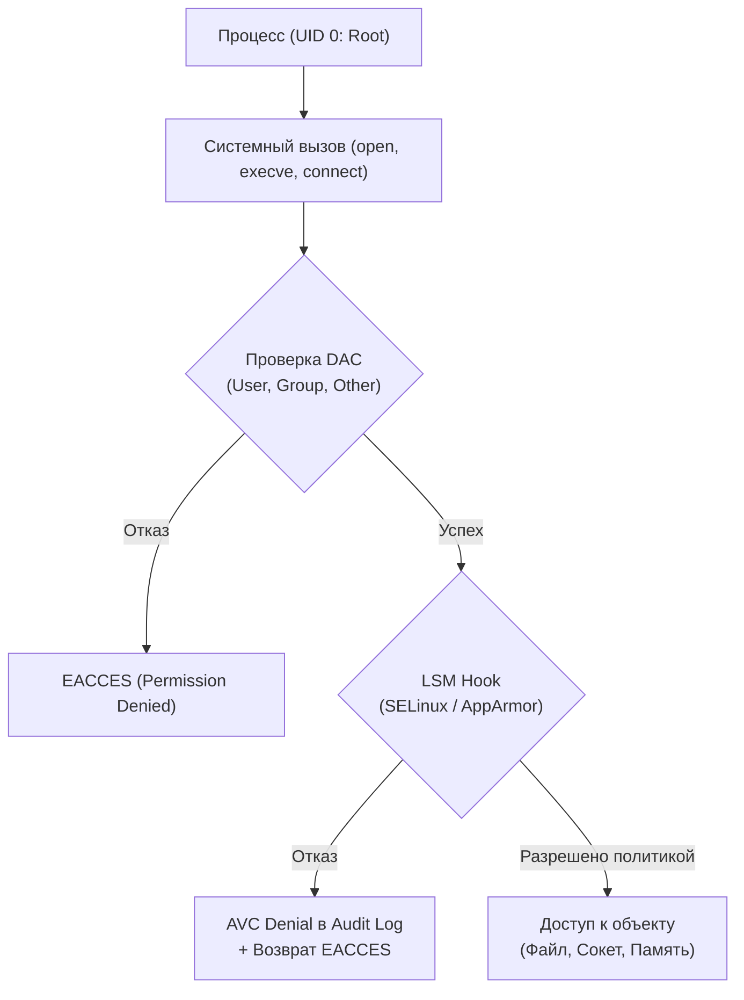

# Модуль 09: Мандатный контроль доступа: Эксплуатация, обход и харденинг SELinux и AppArmor

## 1. Архитектура LSM (Linux Security Modules) и ограничение Root

В классической модели избирательного доступа (DAC — Discretionary Access Control) пользователь `root` (UID 0) обладает неограниченной властью. Если злоумышленник захватывает процесс, работающий от root (например, уязвимость в Nginx или SSHD), он получает полный контроль над системой.

Подсистема **LSM (Linux Security Modules)** встраивает хуки в системные вызовы ядра. Проверка прав происходит в два этапа:
1. Сначала отрабатывает стандартная проверка **DAC** (права `rwx`, владелец, группы). Если DAC запрещает доступ — ядро возвращает `EACCES`.
2. Если DAC разрешил операцию, управление передается хукам **LSM (SELinux / AppArmor)**. Если политика MAC запрещает действие — ядро возвращает `EACCES` и генерирует событие аудита (AVC Denial), **даже если процесс выполняется от имени root**.



---

## 2. Анатомия SELinux: Type Enforcement и векторы атак

SELinux использует модель **Type Enforcement (TE)**. Каждому процессу (субъекту) и каждому объекту (файлу, сокету, порту) присваивается метка безопасности (Security Context):
`user:role:type:level`

Пример: `system_u:system_r:httpd_t:s0` (процесс Apache/Nginx) обращается к файлу `system_u:object_r:httpd_sys_content_t:s0`.

### Ключевые векторы атак и обходов SELinux:

#### 1. Злоупотребление опасными SELinux Booleans (Переключатели)
Системные администраторы часто включают булевы флаги, чтобы "быстро починить работу приложения", не понимая катастрофических последствий для безопасности:
- `httpd_can_network_connect`: разрешает веб-серверу инициировать исходящие TCP-соединения к любым хостам и портам (позволяет злоумышленнику через веб-шелл выгружать данные во внешнюю сеть или спавнить reverse shell).
- `httpd_execmem`: разрешает процессу веб-сервера аллоцировать память с одновременными правами на запись и исполнение (`PROT_WRITE | PROT_EXEC`). Это полностью нивелирует защиту W^X (NX/DEP) и позволяет выполнять shellcode прямо в памяти процесса!
- `httpd_run_stickshift` / `httpd_setrlimit`: расширяют привилегии выполнения дочерних процессов.

```bash
# Проверка опасных активных булевых флагов:
getsebool -a | grep httpd | grep "--> on"
```

#### 2. Переход в неизолированные домены (`unconfined_t`)
Не все процессы в Linux защищены SELinux. Процессы, работающие в домене `unconfined_t` (например, стандартные сессии пользователей или системные службы без профиля), не ограничиваются правилами Type Enforcement:
- Если злоумышленник скомпрометировал ограниченный сервис (`httpd_t`), его цель — найти механизм межпроцессного взаимодействия (D-Bus, cron-задачи, скрипты администратора), который выполняется в `unconfined_t`, и передать туда вредоносный пейлоад для побега из песочницы.

#### 3. Слепое применение `audit2allow` (Admin-Assisted Privilege Escalation)
Когда сервис не работает из-за SELinux, администраторы часто выполняют:
```bash
ausearch -m avc -ts recent | audit2allow -M bad_policy
semodule -i bad_policy.pp
```
Если в этот момент атакующий посылал вредоносные запросы (пытался прочитать `/etc/shadow` из веб-шелла), `audit2allow` автоматически сгенерирует разрешающее правило, легализующее чтение теневого файла паролей сервисом `httpd_t`!

---

## 3. Анатомия AppArmor: Путевой контроль и техники побега

В отличие от SELinux, где метка привязана к метаданным инода (extended attributes `security.selinux`), **AppArmor привязан к путям файловой системы (Path-based)**.

### Режимы работы профилей:
- **Enforce**: Запрещает запрещенные правилами действия и логирует их.
- **Complain**: Разрешает выполнение запрещенных действий, но фиксирует предупреждение в аудит-логе. (Чрезвычайно опасно в проде!).

### Векторы побега и эксплуатации AppArmor:

#### 1. Опасные квалификаторы исполнения (`Ux` vs `px`)
В профилях AppArmor правила запуска исполняемых файлов определяют, с какими ограничениями будет работать дочерняя программа:
- `px` (Discrete profile): переход в изолированный субпрофиль.
- `ix` (Inherit): наследование текущего ограниченного профиля.
- `Ux` / `ux` (**Unconfined Execution**): программа запускается **БЕЗ КАКИХ-ЛИБО ОГРАНИЧЕНИЙ AppArmor**!
  Если в профиле веб-сервера написано:
  `/usr/bin/bash Ux,`
  злоумышленник при вызове `/bin/bash` мгновенно сбрасывает все ограничения AppArmor!

#### 2. Манипуляции путями, симлинками и жесткими ссылками
Так как AppArmor проверяет текстовый путь файла, а не инод:
- Если профиль запрещает чтение `/var/www/secret.key`, но разрешает запись в `/tmp`, и не запрещает создание hardlink:
  Создание жесткой ссылки `ln /var/www/secret.key /tmp/secret.key` могло в старых ядрах позволить прочитать файл, так как путь `/tmp/secret.key` разрешен правилом `/tmp/* rw,`.

#### 3. Злоупотребление пространствами имен (User Namespaces Escape)
Если профиль AppArmor разрешает программе системный вызов `unshare` или запуск непривилегированных пространств имен пользователей:
Атакующий создает новый User Namespace, где получает "виртуальный" root, монтирует поддельную файловую систему и обходит путевые ограничения родительского профиля.

---

## 4. Разработка защищенных политик и правил детекции

### Создание эталонного профиля AppArmor:
```apparmor
# /etc/apparmor.d/srv.custom_api
#include <tunables/global>

/srv/custom_api/app {
  #include <abstractions/base>
  #include <abstractions/python>

  # Запрет любых capabilities суперпользователя
  deny capability sys_admin,
  deny capability sys_ptrace,
  deny capability setuid,

  # Разрешение чтения только своей директории
  /srv/custom_api/** r,
  /srv/custom_api/logs/*.log w,

  # Сетевой доступ: только TCP-сокеты
  network inet stream,
  network inet6 stream,

  # Полный запрет доступа к системным секретам
  deny /etc/shadow* rwx,
  deny /etc/sudoers* rwx,
  deny /root/** rwx,
}
```

### Загрузка и принудительное включение:
```bash
sudo apparmor_parser -r /etc/apparmor.d/srv.custom_api
sudo aa-enforce /srv/custom_api/app
sudo aa-status
```
