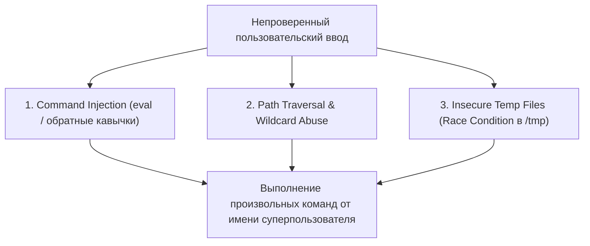

# Модуль 10: Безопасность автоматизации: Защищенный Bash, аудит скриптов и Incident Response

## 1. Безопасность shell-скриптов и уязвимости интерпретации

Bash является основным инструментом системного администрирования, но при небрежном написании скриптов они становятся прямым вектором компрометации системы и эскалации привилегий (Privilege Escalation).

### Главные классы уязвимостей в Bash:



#### 1. Опасность использования `eval`
Команда `eval` повторно парсит и выполняет строку как shell-код. Если в строку попадает внешний ввод:
```bash
# УЯЗВИМЫЙ КОД:
# Администратор хотел динамически читать конфигурацию:
config_key="$1"
eval "value=\$$config_key"

# Атакующий передает: "dummy; id; cat /etc/shadow"
# eval исполняет обе команды с правами скрипта!
```
**Безопасный подход**: Использование ассоциативных массивов (`declare -A`) или косвенных ссылок:
```bash
# БЕЗОПАСНЫЙ КОД:
value="${!config_key}"
```

#### 2. Инъекция через утилиты поиска и подстановки
Частая ошибка — передача непроверенного имени файла в команды:
```bash
# УЯЗВИМЫЙ КОД:
find /data -name "$USER_INPUT" -exec rm -rf {} +
```
Если `USER_INPUT` содержит подстановочные флаги (например `-delete` или `-exec`), поведение утилиты изменяется.

#### 3. Небезопасные временные файлы и симлинк-атаки (TOCTOU)
Использование статических путей в `/tmp` (например `/tmp/backup.tar`) уязвимо к атаке типа Time-of-Check to Time-of-Use:
Атакующий заранее создает символическую ссылку `/tmp/backup.tar -> /etc/shadow`. Когда запущенный от root скрипт делает запись в `/tmp/backup.tar`, он перезаписывает системный файл паролей.
**Решение**: Всегда использовать `mktemp`:
```bash
SECURE_TMP=$(mktemp -d /tmp/audit_run_XXXXXX)
trap 'rm -rf "$SECURE_TMP"' EXIT INT TERM
```

---

## 2. Разработка защищенного сборщика улик (Forensics Collector)

В случае инцидента безопасности первой задачей инженера является сбор **энергозависимых данных (Volatile Data)** до перезагрузки системы. Порядок сбора определяется **порядком изменчивости (Order of Volatility, RFC 3227)**:

1. Сетевые соединения и открытые сокеты (`ss -tulnep`)
2. Активные процессы и связи предок-потомок (`ps auxfww`)
3. Текущие пользователи и сессии (`who`, `w`, `last`)
4. Состояние интерфейсов и таблиц маршрутизации (`ip a`, `ip route`)
5. Буфер сообщений ядра (`dmesg -T`)
6. Контрольные суммы собранных доказательств (SHA-256) для сохранения юридической цепочки владения (Chain of Custody).

---

## 3. Мониторинг целостности системы (Host Integrity Monitoring) на Bash

Скрипт мониторинга хоста должен непрерывно отслеживать ключевые аномалии:
- Появление новых файлов с установленным битом SUID/SGID.
- Появление новых учетных записей в `/etc/passwd` с UID 0 или доступом к интерактивному шеллу.
- Открытие неожиданных сетевых портов на прослушивание.
- Изменение содержимого файлов `/etc/sudoers` и `/etc/crontab`.
