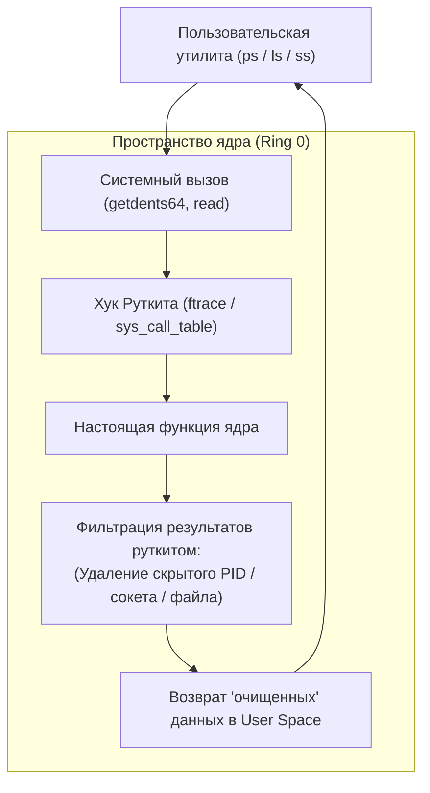

# Модуль 11: Безопасность ядра, изоляция контейнеров и обнаружение руткитов

## 1. Архитектура ядра Linux и механизмы работы руткитов

Ядро Linux функционирует в режиме наивысших привилегий процессора (Ring 0 / Supervisor Mode). Традиционные антивирусные средства и утилиты мониторинга пользовательского пространства (User Space, Ring 3) доверяют данным, которые возвращает ядро через системные вызовы.

Если в пространство ядра внедряется недоверенный код (LKM Rootkit):
- Он перехватывает системный вызов `sys_getdents64` и вырезает из списка возвращаемых файлов любые записи с префиксом вредоноса. В результате ни `ls`, ни `find`, ни сканеры безопасности не видят вредоносные файлы на диске.
- Он перехватывает чтение `/proc` и удаляет структуру `task_struct` вредоносного процесса из двусвязного списка процессов ядра. В результате `ps`, `top`, `htop` не отображают процесс, хотя он продолжает исполняться планировщиком!
- Он перехватывает сетевые вызовы в подсистеме Netfilter / TCP, скрывая открытые бэкдор-порты от `ss` и `netstat`.



---

## 2. Безопасность контейнеров: Пространства имен и векторы побега

Контейнеры в Linux (Docker, Podman, Kubernetes) — это **НЕ** виртуальные машины. Это обычные изолированные процессы, работающие на общем хостовом ядре. Изоляция обеспечивается двумя ключевыми примитивами ядра:
1. **Namespaces** (Пространства имен): изолируют видимость ресурсов (PID, Mount, Net, IPC, UTS, User, Cgroup).
2. **Cgroups** (Контрольные группы): ограничивают потребление ресурсов (CPU, RAM, I/O).

### Главные векторы побега из контейнеров на хост (Container Escape):

#### 1. Флаг `--privileged` (Полный доступ к устройствам хоста)
При запуске контейнера с флагом `--privileged`:
- Ядро отключает профили AppArmor/Seccomp.
- Контейнер получает доступ ко всем блочным устройствам хоста в каталоге `/dev` (включая `/dev/sda` или `/dev/nvme0n1`).
- **Механизм побега**: Контейнер может напрямую смонтировать корневой раздел хоста:
  ```bash
  mkdir /host_fs && mount /dev/sda1 /host_fs
  # Доступ ко всем файлам хостовой ОС (включая /etc/shadow и SSH ключи root)!
  ```

#### 2. Опасные Linux Capabilities
Даже без флага `--privileged` назначение отдельных capabilities делает возможным компрометацию хоста:
- `CAP_SYS_ADMIN`: фактически эквивалентен root, позволяет монтировать файловые системы и манипулировать cgroups.
- `CAP_SYS_PTRACE`: позволяет внедрять код в память процессов хоста через `process_vm_writev` или `ptrace`.
- `CAP_SYS_MODULE`: позволяет загружать LKM модули прямо в хостовое ядро.

#### 3. Проброс Docker сокета (`/var/run/docker.sock`)
Если в контейнер проброшен UNIX-сокет Docker:
Контейнер может отправить команду хостовому демону Docker на запуск нового привилегированного контейнера с монтированием хостового корня:
```bash
docker run -v /:/host -it alpine chroot /host
```

---

## 3. Харденинг ядра через параметры `sysctl`

Для защиты от эксплуатации ядра и скрытия отладочной информации настраиваются строгие параметры в `/etc/sysctl.d/99-kernel-security.conf`:

```ini
# Запрет чтения dmesg непривилегированными пользователями (защита от утечки адресов ядра)
kernel.dmesg_restrict = 1

# Скрытие указателей ядра в /proc/kallsyms (предотвращение обхода KASLR)
kernel.kptr_restrict = 2

# Отключение непривилегированного eBPF (предотвращение атак на ядро через фильтры)
kernel.unprivileged_bpf_disabled = 2

# Запрет отладки чужих процессов через ptrace (защита от кражи памяти)
kernel.yama.ptrace_scope = 2

# Полное отключение динамической загрузки модулей ядра после старта системы
# ВНИМАНИЕ: После включения ни один драйвер/модуль не может быть загружен до перезагрузки!
kernel.modules_disabled = 1
```
